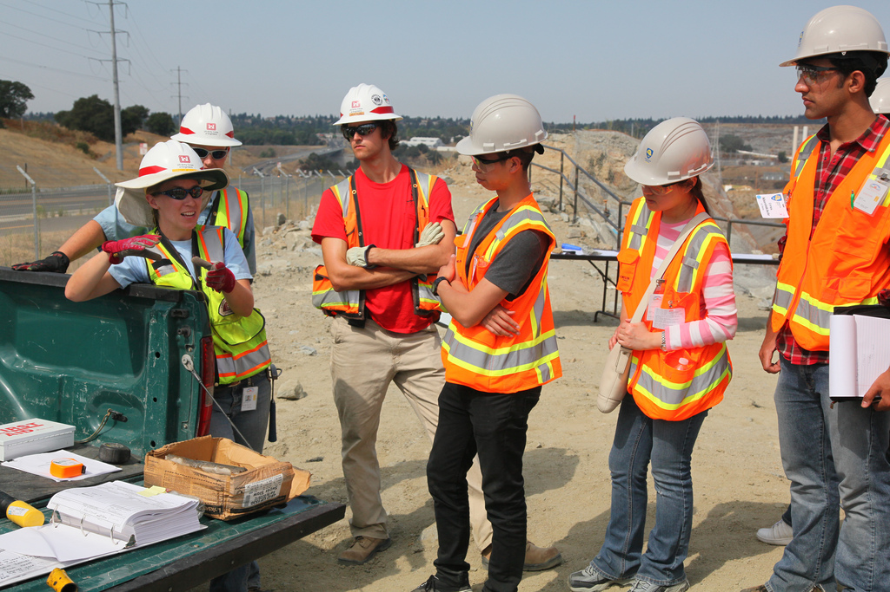

## Engineering Disciplines

Engineering is fairly broad and can be divided into disciplines or branches. These disciplines or branches are more specific than engineering in general. The three most common engineering disciplines are Civil Engineering, Electrical Engineering, and Mechanical Engineering.

### Civil Engineering

Image Credit: CC0 1.0 Public Domain

As the design of civilian structures, such as bridges and buildings, matured as a technical discipline, the term civil engineering entered the lexicon as a way to distinguish between those specializing in the construction of such non-military projects and those involved in the discipline of military engineering.

### Electrical Engineering

Image Credit: attribute copyright to © BAE Systems [CC BY-NC-ND 2.0](https://creativecommons.org/licenses/by-nc-nd/2.0/)

Electrical engineers are involved in the research, design, development, testing, manufacture and installation of electrical equipment, components and systems. Electrical engineers also apply electrical, electronic and magnetic theories to solve problems in the design, manufacture and use of electrical machines.

### Mechanical Engineering

Image Credit: Desiree Crossley/Advanced Manufacturing Partnerships in Education/AMPed NH [CC BY 2.0](https://creativecommons.org/licenses/by/2.0/)

One of the most diverse and versatile engineering fields, mechanical engineering is the study of objects and systems in motion. Mechanical engineers design, build, and maintain mechanical systems.

### Other Engineering Disciplines

Besides Civil, Electrical, and Mechanical - there are other engineering disciplines. Below is a partial list a few other engineering disciplines in alphabetical order.

#### Aeropace Engineering

Image Credit: [PDM 1.0](https://creativecommons.org/publicdomain/mark/1.0/)

Aerospace engineers design, develop, and test aircraft, spacecraft, satellites, and missiles. In addition, they create and test prototypes to make sure that they function according to design.

#### Agriculture Engineering

Image Credit: O'ahu Resource Conservation and Development Council [CC BY-NC-ND 4.0](https://creativecommons.org/licenses/by-nc-nd/4.0/)

Agricultural engineers attempt to solve agricultural problems concerning power supplies, the efficiency of machinery, the use of structures and facilities, pollution and environmental issues, and the storage and processing of agricultural products.

#### Architectural Engineering

Image Credit: [CC0 1.0](https://creativecommons.org/publicdomain/zero/1.0/)

Architectural engineers apply practical and theoretical knowledge to the engineering design of buildings and building systems. The goal is to engineer high-performance buildings that are sustainable, resilient, economically viable, that ensure the safety, health, comfort, and productivity of occupants.

#### Automotive Engineering

Image Credit: [CC0](https://creativecommons.org/public-domain/)

Automotive Engineering is a branch of vehical engineering. Automotive Engineering involves mechanical, electrical, software and other systems in the domain of motocycle, automobile, and truck design, manufacture, maintenance, testing and modification.

#### Bioengineering

Image Credit: UCSD Jacobs School of Engineering, no modifications [CC BY 2.0](https://creativecommons.org/licenses/by/2.0/)

Bioengineers and biomedical engineers combine engineering principles with sciences to design and create equipment, devices, computer systems, and software.

Biomedical engineers focus on advances in technology and medicine to develop new devices and equipment for improving human health. For example, they might design software to run medical equipment or computer simulations to test new drug therapies. In addition, they design and build artificial body parts, such as hip and knee joints, or develop materials to make replacement parts. They also design rehabilitative exercise equipment.

#### Chemical Engineering

Image Credit: [CC0 1.0](https://creativecommons.org/publicdomain/zero/1.0/)

Chemical engineers will be responsible for monitoring and troubleshooting existing chemical processes and proposing modifications to improve chemical process performance.

#### Construction Engineering

Image Credit: [PDM 1.0](https://creativecommons.org/publicdomain/mark/1.0/)

Construction engineers manage construction projects, ensuring that they are scheduled and built according to plans and specifications. They typically are responsible for the design and safety of any temporary structures used during construction. They also may oversee a project’s budget and communications.

#### Computer Engineering

Computer engineering is a broad field that sits in between the hardware of electrical engineering and the software of computer science. When computer engineers design hardware, they focus on what the hardware is trying to accomplish as opposed to the nitty-gritty details of how to lay out the transistors. Computer engineers design the processors for systems of all sizes.

A special focus of computer engineers is the connections between devices, whether there is a cord making the connection or if it's a wireless connection. The computer engineer doesn't care so much about the actual voltages or wireless signals, but is more interested in the protocol that is used to send the data.

#### Engineering Management

Engineering managers serve as bridges between the technical aspects of engineering projects and the overarching goals of their organizations. These professionals oversee the coordination, planning and execution of engineering tasks, ensuring projects align with corporate strategies. Engineering managers role encompasses a wide range of responsibilities, from leading innovative development and research initiatives to formulating budgets and managing multidisciplinary teams. Engineering managers not only delegate tasks according to team members' expertise but also foster collaboration with other departments.

#### Environmental Engineering

Environmental engineers use engineering disciplines in developing solutions to problems of planetary health. Their work may involve concerns such as waste treatment, site remediation, and pollution control technology.

Environmental engineers work on a variety of projects. For example, they may conduct hazardous-waste management studies in which they evaluate a hazard and advise on treating and containing it. They also design systems for municipal and industrial water supplies and wastewater treatment. In government, they may focus on prevention and compliance, such as researching the environmental impact of proposed construction projects or enforcing regulations for disposal of agricultural waste.

#### Geological Engineering

According to the U.S. Bureau of Labor, geological engineers search for mineral deposits and evaluate possible sites. Once a site is identified, they plan how the metals or minerals will be extracted in efficient and environmentally sound ways.

#### Geotechnical Engineering

Geotechnical engineers ensure the safety and sturdiness of foundations for streets, buildings, and other structures and systems. They focus on how these manmade objects interact with the earth, including soil and rock. In this way, their work relates to that of environmental engineers.

#### Industrial Engineering

The design or improvement of a system of people, machines, information, and money to achieve some goal with efficiency, quality, and safety.

Being an Industrial Engineer (IE) is very satisfying because you can create an efficient and safe workplace where people are proud of the high quality products and services they produce. IEs improve efficiency, which means that we help bring prosperity. IEs improve quality, which means that we help provide good products and services. And IEs improve safety, which means that we help protect people. You should be very proud that you plan to become an IE. According to the bumper sticker version of industrial engineering, IEs make things better.

#### Manufacturing Engineering

Manufacturing engineers design or improve manufacturing systems or related processes. They may focus on the automated aspects of manufacturing production, upgrades to facility layout, or changes to processes to reduce costs and improve product quality. They also design manufacturing systems to optimize the use of computer networks, robots, and materials.

#### Materials Science and Engineering

Materials Science and Engineering (MSE) as a field has grown out of our desire to make things that better our lives; there has always been an interest in the stuff we use to make these things. From manipulating materials existing in nature like wood, bone, stone, and clay, to creating new materials through the smelting of metals or firing of clays to create ceramics, civilization evolved alongside our ability to manipulate materials. For millennia, people have learned through trial and error how to manipulate existing materials to create new materials with new properties. They have handed this knowledge down through generations. In some cases new materials were discovered by alchemists seeking to create gold. As the science of chemistry evolved, we began to create completely synthetic materials such as polymers, and eventually we developed the tools to examine the microstructure. This led to the ability to correlate how processing the material affected its structure and how that in turn affected the properties of that material. Understanding how this relationship influenced the performance of a material led to the birth of the discipline of MSE in the middle of the twentieth century. By combining earlier fields like ceramics and metallurgy with MSE, our understanding of materials continues to evolve rapidly with novel innovation occurring at the interface of the study of different materials.

#### Nuclear Engineering

Nuclear engineers research and develop projects or address problems concerning the release, control, and use of nuclear energy and nuclear waste disposal. Some of these engineers research new reactor designs. Others may specialize in the development of safety regulations related to the handling of nuclear materials or operation of nuclear power.

#### Petroleum Engineering

Petroleum engineers devise methods to improve oil and gas extraction and production. They also oversee drilling and offer technical advice.

Petroleum engineers work with geoscientists and other specialists to explore for oil and gas deposits, or reservoirs, in rock formations underground. After discovering reservoirs, petroleum engineers determine the best methods of extraction through wells on land or offshore rigs at sea. Their tasks may include designing the well, selecting drilling methods and equipment, and designing surface facilities.

#### Software Engineering

Software engineers take a broad view of a project's system and software requirements, planning its scope and order of work. These workers may direct software developers, quality assurance analysts, and testers.

#### Structural Engineering

Structural engineers design and assess major projects, such as buildings, bridges, and dams, to ensure their strength and durability.
