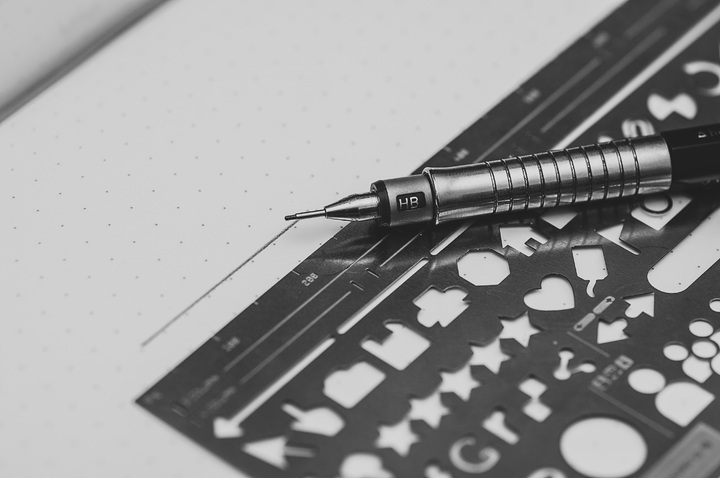
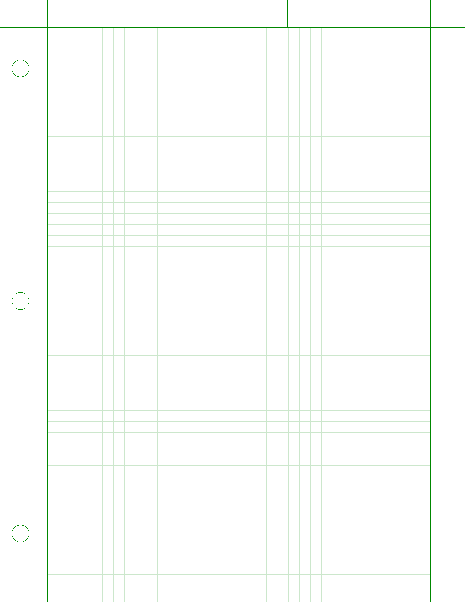
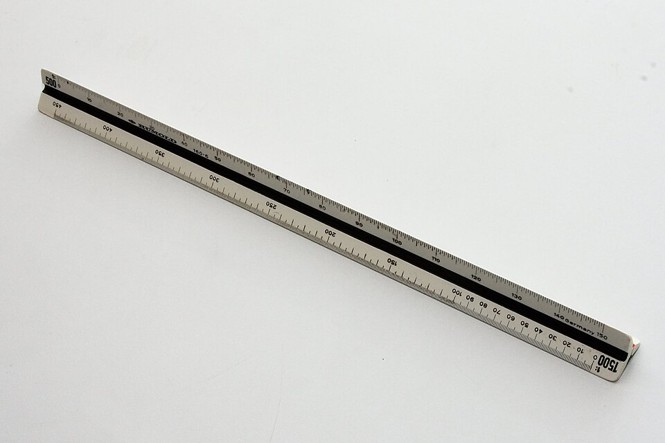
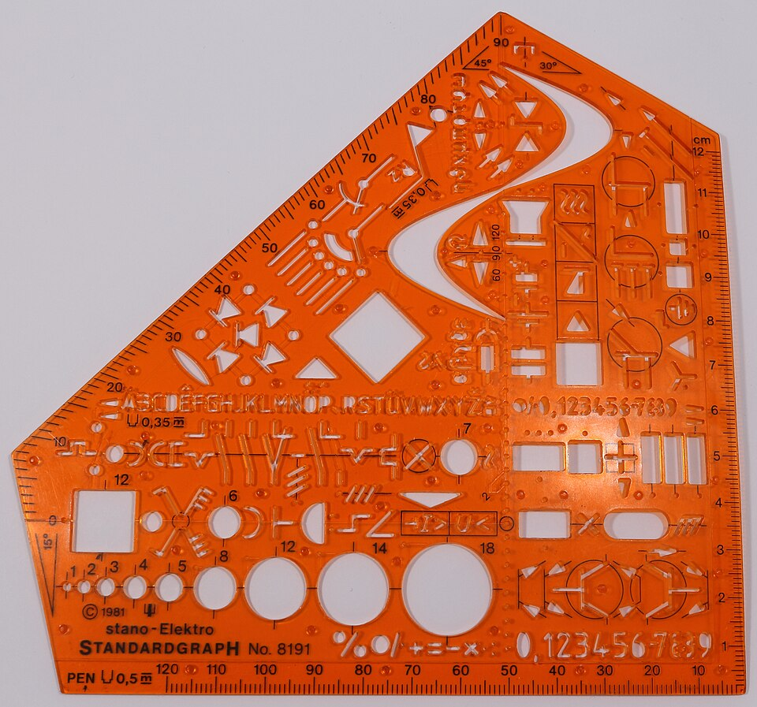
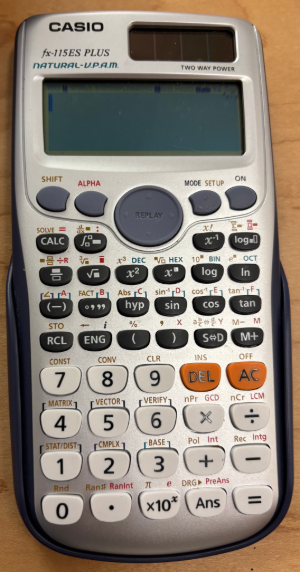
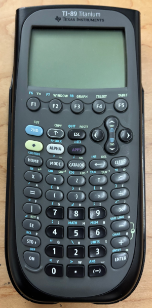
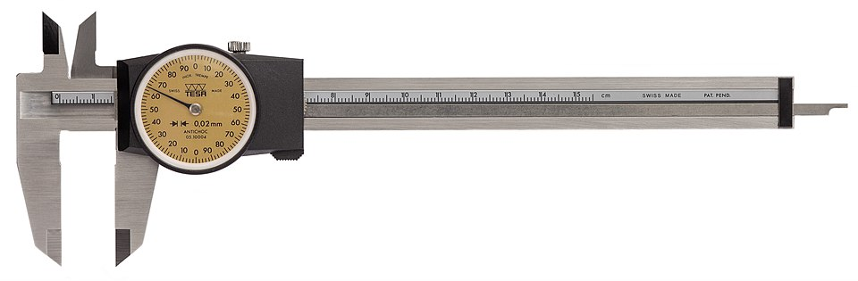
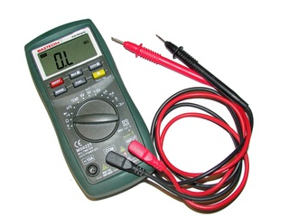

## Engineering Tools

Engineers use a variety of tools to complete their work. This section details some of the tools engineers use to get their job done.

### Pencil and Paper

Engineers sometimes use pencil and paper. These tools can be used for simply jotting down notes, creating back of the envelope calculations, or create a preliminary design. Not all professional engineers do most of their work on pencil and paper anymore, but most professional engineers do use pencil and paper from time to time.

#### Mechanical Pencils

Many engineers use mechanical pencils and ereasers.

image credit: Photo by form PxHere [CC0 Public Domain](https://creativecommons.org/publicdomain/) 

#### Engineering Paper

Engineering paper is a specific type of paper used by engineers. Engineering paper usually comes in pads.

image credit: Xiong, Wikimedia Commons [CC BY-SA 3.0](https://creativecommons.org/licenses/by-sa/3.0/)

#### Engineering Rulers

Engineering rulers are used to make drawings and straight lines. The sides of an engineering ruler have different length scales.

image credit: Schorle, Wikimedia Commons [CC BY-SA 3.0](https://creativecommons.org/licenses/by-sa/3.0/)

#### Engineering Drawing Stencils

It can be helpful to use engineering drawing stencils when creating engineering drawings by hand. Electrical engineers, mechanical engineers, and civil engineers all use symbols in drawings to convey information.

image credit: Wikimedia: NobbiP [CC BY-SA 2.0](https://creativecommons.org/licenses/by-sa/2.0/deed.en)

### Calculators

#### Scientific Calculators

#### Graphing Calculators

#### FE and PE Exam Calculators

The Fundamentals of Engineering Exam (FE) and the Principles and Practice of Engineering Exam (PE) require certain specific scientific calculator models. Consider one of these approved calculator models to use during your engineering education. As these calculator models will be the kind you will use on the FE and PE exams.

According to NCESS, the organization which administers the FE and PE Exams:

 > To protect the integrity of its exams, NCEES limits the types of calculators examinees may bring to exam sites. The list of approved calculators is reviewed annually.

The following calculator models are the only ones acceptable for use during the 2025 exams:

 * Casio: All fx-115 and fx-991 models (Any Casio calculator must have "fx-115" or "fx-991" in its model name.)
 
 * Hewlett Packard: The HP 33s and HP 35s models, but no others

 * Texas Instruments: All TI-30X and TI-36X models (Any Texas Instruments calculator must have "TI-30X" or "TI-36X" in its model name.)

For more information, review the NCESS calculator policy at [https://ncees.org/exams/](https://ncees.org/exams/)

### Measuring Tools

#### Calipers

Calipers are instruments which are used to measure length. Calipers can be electronic or manual, also called dial calipers.

image credit: Wikimedia: Lucasbosch [CC BY-SA 4.0](https://creativecommons.org/licenses/by-sa/4.0/deed.en)

#### Digital Multimeters

Digital multimeters are electronic instruments that can measure resistance, voltage and current.

image credit: pxhere [CC0 1.0](https://creativecommons.org/publicdomain/zero/1.0/)

### Computer Tools

#### CAD

#### Spreadsheets

#### Computer Programming

### Reference Standards

#### Hard Copy Reference Books

#### Web-based References
