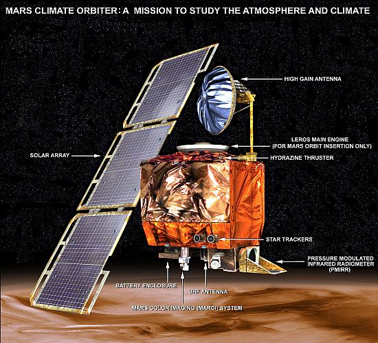
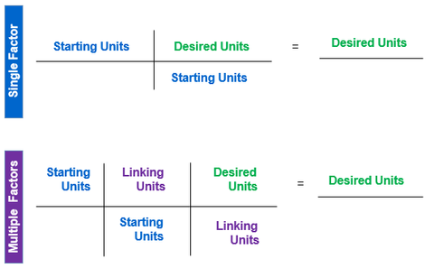
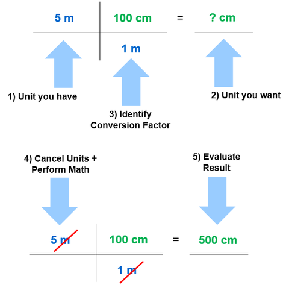

## Unit Conversion

### Learning Objectives

By the end of this section, you will be able to:

 * Use conversion factors to convert a given quantity into a different set of units.

### Why Unit Conversion is Important



Image Credit: NASA https://nssdc.gsfc.nasa.gov/nmc/spacecraft/display.action?id=1998-073A

Unit conversion is an important skill for engineers. Unit conversions may not seem very interesting, but not doing them can be costly. One famous example of this situation was seen with the Mars Climate Orbiter. This probe was launched by NASA on December 11, 1998. On September 23, 1999, while attempting to guide the probe into its planned orbit around Mars, NASA lost contact with it. Subsequent investigations showed a piece of software called SM_FORCES (or "small forces") was recording thruster performance data in the English units of pound-seconds (lb-s). However, other pieces of software that used these values for course corrections expected them to be recorded in the SI units of newton-seconds (N-s), as dictated in the software interface protocols. This error caused the probe to follow a very different trajectory from what NASA thought it was following, which most likely caused the probe either to burn up in the Martian atmosphere or to shoot out into space. This failure to pay attention to unit conversions cost hundreds of millions of dollars, not to mention all the time invested by the scientists and engineers who worked on the project.

### Unit Conversion Factors

To convert between different units, we need to how how much one unit is equal to in another unit. These are called _conversion factors_. Conversion factors can be used to convert between units in one system, such as 1 m = 100 cm in the SI unit system. Conversion factors can also be used to convert between units accross different unit systems, such as 1 m = 39.3701 in. 

Below is a table of some common unit conversion factors.

| Table of Unit Conversion Factors |
| --- |
| **Length** |
| 1 $m$ = 3.28084 $ft$ |
| 1 $in$ = 2.54 $cm$ (exact) |
| 1 $ft$ = 12 $in$ |
| 1 $mi$ = 5280 $ft$ (exact) |
| **Volume** |
| 1 $cm^3$ = 1 $mL$ (exact) |
| 1 $ft^3$ = 7.48052 $gal$ |
| 1 $gal$ = 231 $in^3$ (exact) |
| **Mass** |
| 1 $lb_m$ = 0.45359237 $kg$ (exact) |
| 1 $slug$ = 32.174 $lb_m$ |
| **Time** |
| 1 minute = 60 seconds (exact) |
| 1 hour = 60 minutes (exact) |
| 1 day = 24 hours (exact) |
| 1 year = 365 days |
| **Force** |
| 1 $lb_f$ = 1 $slug \cdot ft/s^2$ (exact) |
| 1 $N$ = 1 $kg \cdot m/s^2$ (exact) | 
| 1 $N$ = 0.224808943 $lb_f$ |
| 1 $kip$ [kilopound] = 1000 $lb_f$ (exact) |
| **Pressure / Stress** ||
| 1 $Pa$ = 1 $N/m^2$ (exact) |
| 1 $psi$ [pound per square inch] = 1 $lb_f/in^2$ (exact) |
| 1 $ksi$ [kilpound per square inch] = 1 $kip/in^2$ (exact) |
| **Energy** |
| 1 $Btu$ = 1055.06 $J$ |
| 1 $J$ = 1 $N \cdot m$ (exact) |
| **Power** |
| 1 $W$ = 1 $J/s$ (exact) |
| 1 $hp$ = 735.499 $W$ |
| 1 $hp$ = 550 $lb_f \cdot ft/s$ (exact) |

### Unit Conversion Process

The unit conversion process uses the fact that any number or expression can be multiplied by 1 without changing its value. This allows the conversion of units by multiplying the initial value by one (or more) forms of the number 1.

```{note}
While the multiplication by 1 does not change the _value of a measurement_, multiplying a value by 1 can change the _measurement units_.
```

It may be necessary to multiply by more than one conversion ratio in complex unit conversions. Use the steps below to construct a unit conversion problem so one (or more) of the units cancel until only the desired unit remains:

```{card} **Unit Conversion Steps**

**Step 1.** Identify the unit you have. These are the _Starting Units_ or _Initial Units_.

**Step 2.** Identify the unit you want. These are the _Desired Units_ or _Final Units_.

**Step 3.** Identify appropriate unit conversion factor(s). These are the Linking (or Ratio) Unit(s). Use **EXACT** conversion factors whenever available.

**Step 4.** Cancel units and perform the math calculations (e.g., multiply, divide). Repeat the calculation (double check).

**Step 5.** Evaluate the result. _Does the answer make sense?_

```

Below are some best practices to consider when completing unit conversion calculations.

```{tip} **Unit Conversion Best Practices**

 * Multiply the numerators (across) and denominators (across) to calculate an intermediate answer, then divide. Documenting the calculation steps can be especially helpful when problem-solving errors.

 * Do not round any quantities used within the calculation. Keep at least two more digits of precision in each calculated value than is present in the initial value.

 * Only round the final calculated quantity.
```

Many unit conversion problems will require only a single unit conversion factor. However, multiple unit conversion factors may be required to solve a problem. The figures below illustrate both examples. Remember that Step 3, identifying the conversion factor, is often the most challenging step. If an incorrect (or approximate) conversion factor is used, a correct solution will not be achieved.



Image Credit: NIST

**Worked Example**

An engineer has designed a new 5 $m$ computer cable but must represent the length in centimeters within an owner manual diagram. How many $cm$ is the length?



Image Credit: NIST

### Section Summary

In this section, you learned about unit conversion. We can convert a value from one set of units to another set of units using unit conversion factors.

To complete a unit conversion problem, identify the starting units and desired units. Pick approprate conversion factors. Write the conversion factors as fractions so that the conversion factor cancels the starting units and leaves you with the desired units.
