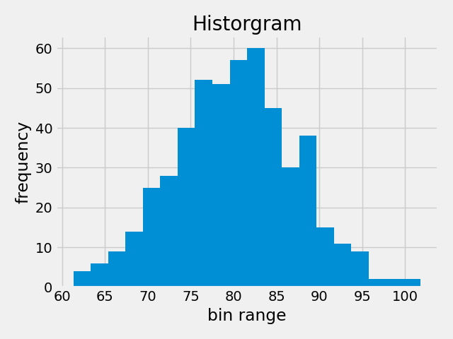
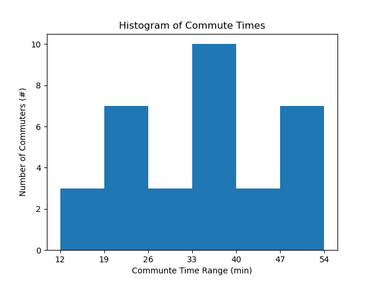

## Histograms

 It is often useful to have a graphical representation of the data when using statistics. One of those images is called a _histogram_.



A histogram is a bar graph that displays frequency of occurrence, also called a frequency distribution. A histogram consists of contiguous (adjoining) boxes or bars. It has both a horizontal axis and a vertical axis. The horizontal axis is labeled with what the data represents (for instance, distance from your home to school). The vertical axis is labeled either frequency or relative frequency (or percent frequency or probability). The graph will have the same shape with either label. A histogram can give you the shape of the data, the center, and the spread of the data.

### How to create a Histogram

How to create a histogram for a particular data set of n points:

1. Find the range of the data. The range ($r$) is the largest value ($x_{min}$) minus the smallest value($x_{max}$) in the data set.

$$ r = x_{max} – x_{min} $$

2. Determine classes (bins) for the data.  

 * No fewer than 6 classes (bins) should be used.
 * A good rule of thumb for the number of bins ($n_{bins}$) is approximely equal to the square root of the number of values ($n$)

$$ n_{bins} = \sqrt{n} $$
         
* Classes should be of equal size
* Bin width is equal to the range divided by the number of bins

$$ bin \ width = \frac{r}{n_{bins}} $$

3. Determine the number of data points in each class. Create a chart with the bin ranges in one column and the number of data points within that bin range in the second column.

4. Draw the histogram. Scale your y-axis corresponding to the highest frequency. Spread your bin ranges out across the x-axis. It can be helpful to draw a line for the top of each bin then fill in the vertical bars for each bin. Note: histograms typically have no spaces between the bars.

```{card} **Worked Example**
**GIVEN:**

Commute times for a class students to get from their home to an in-person engineering class were recorded to the nearest minute. Individual commute times given below

23, 25, 40, 35, 36, 47, 33, 28, 48, 34, 20,
20, 37, 36, 23, 33, 36, 20, 27, 50, 34, 12,
47, 18, 28, 52, 21, 44, 34, 13, 40, 49, 54

**FIND:**

Draw a histogram of the data

**SOLUTION:**

1. Find the range

$$ range = max - min = 54 - 12 = 42 $$

2. Create the bins

$$ n_{bins} = \sqrt{33} = 5.7445 $$

Since 5.7455 is less than 6, we will use the minimum number of bins.

$$ n_{bins} = 6 $$

Determine the bin width

$$ bin \ width = \frac{range}{n_{bins}} $$

$$ bin \ width = \frac{42}{6} = 7 $$

Create a chart of bin ranges and the number of data points in each

| bin range | # of data points |
| --- | --- |
| 12 - 18 | 3 |
| 19 - 25 | 7 |
| 26 - 32 | 3 |
| 33 - 39 | 10 |
| 40 - 46 | 3 |
| 47 - 54 | 7 |

4. Draw the histogram.

The highest y-axis (vertical axis) value is 10.

Each bar on the histogram has a height equal to the number of data points in that bin range.

Label the x and y axes and include units.



```
