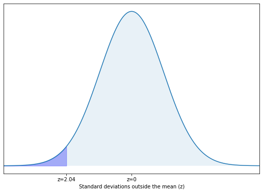

## Gaussian Distribution

A bell curve, Gaussian distribution, and normal distribution all refer to a curve with a characteristic bell shape that is symmetric about the mean and extends indefinitely in both directions.


The curve is symmetric about a vertical line drawn through the mean, $\mu$. The normal distribution depends only on the mean and the standard deviation. Since the area under the curve must equal one, a change in the standard deviation, $\sigma$, causes a change in the shape of the curve. The curve becomes fatter or skinnier depending on $\sigma$. A change in $\mu$ causes the graph to shift to the left or right. This means there are an infinite number of normal probability distributions. One of special interest is called the standard normal distribution.

The probability density function is a rather complicated mathematical function. For an introductory engineering student, you do not need to memorize it.

$$ f(x)=\frac{1}{\sigma\sqrt{2\pi}}e^{-\frac{1}{2}[\frac{(x-\mu)}{\sigma}]^{2}} $$

The cumulative distribution function is P(X < x). It is calculated either by a calculator or a computer, or it is looked up in a table.

### Z-Scores

The standard normal distribution is a normal distribution of standardized values called _z-scores_. A z-score is measured in units of the standard deviation. For example, if the mean of a normal distribution is five and the standard deviation is two, the value 11 is three standard deviations above (or to the right of) the mean. The calculation is as follows:

$$ x = \mu + (z)(\sigma) = 5 + (3)(2) = 11 $$

In this case, the z-score is 3 for an x value of 11.

The mean $\mu$ for the standard normal distribution is zero, and the standard deviation $\sigma$ is one. The equation for the z-transformation is below:

$$ z =  \frac{x-\mu}{\sigma} $$

The value $x$ in the given equation comes from a normal distribution with mean $\mu$ and standard deviation $\sigma$. $z$ is the z-score of a particular value of $x$.

```{card} **Worked Example**
**GIVEN:**

$X$ is a normally distributed random variable with mean $\mu$ = 5 and standard deviation $\sigma$ = 6. Suppose $x$ = 17.

**FIND:**

The z-score for $x$ and the number of standard deviations $x$ is outside the mean.

**SOLUTION:**

**Z-score**

mean $\mu$ = 5

standard deviation $\sigma$ = 6

given value $x$ = 17

$$ z =  \frac{x-\mu}{\sigma} = \frac{17-5}{6} $$

$$ z = –0.67 $$

The z-score of $x$ = 17 is $z$ = -0.67

**Number of standard deviations outside the mean**

A z-score of $z$ = -0.67 means that $x$ = 17 is 0.67 of a standard deviations below, or to the left of the mean.

```

### The Empirical Rule

If X is a random variable and has a normal distribution with mean $\mu$ and standard deviation $\sigma$, then the Empirical Rule states the following:

 * About 68% of the x values lie between –1$\sigma$ and +1$\sigma$ of the mean $\mu$ (within one standard deviation of the mean).
 * About 95% of the x values lie between –2$\sigma$ and +2$\sigma$ of the mean $\mu$ (within two standard deviations of the mean).
 * About 99.7% of the x values lie between –3$\sigma$ and +3$\sigma$ of the mean $\mu$ (within three standard deviations of the mean). Notice that almost all the x values lie within three standard deviations of the mean.
 * The z-scores for +1$\sigma$ and –1$\sigma$ are +1 and –1
 * The z-scores for +2$\sigma$ and –2$\sigma$ are +2 and –2
 * The z-scores for +3$\sigma$ and –3$\sigma$ are +3 and –3

```{note}
The empirical rule is also known as the 68-95-99.7 rule
```


Image Credit: Introductory Statistics 2e Barbara Illowsky and Susan Dean

### Calculations of Probabilities

The normal distribution curve can be used to calculate probabilities.

The shaded area in the following graph indicates the area to the left of x. This area is represented by the probability P(X < x). Normal tables, computers, and calculators provide or calculate the probability P(X < x).


Image Credit: Introductory Statistics 2e Barbara Illowsky and Susan Dean

Remember, P ( X < x ) = Area to the left of the vertical line through x (the shaded area). The area to the right, the unshaded area, is then P ( X > x ) = 1 – P ( X < x ).

P ( X > x ) = 1 – P ( X < x ) = Area to the right of the vertical line through x.

P ( X < x ) is the same as P ( X $\leq$ x ) and P ( X > x ) is the same as P ( X $\geq$ x ) for continuous distributions.


```{card} **Worked Example**
**GIVEN:**

The mean annual precipitation for Portland, Oregon over 5 years was found to be 36.2 in with a standard deviation of 7.8 in.  Assume that the precipitation follows a normal distribution.

**FIND:**

Determine the probability that the precipitation in Portland in any given year is less than 20.3 in.

**SOLUTION:**

Step 1. Read the problem and determine the knowns and the unknowns.

From the problem we can see the mean is 36.2, the standard deviation is 7.8, we have a known x-value of 20.3 and we are looking for the probability that the yearly participation is less than our x-value of 20.3.

$$
\mu = 36.2

\sigma = 7.8

x_1 = 20.3

P_{<20.3} = ?
$$

Step 2. Plot the knowns and unknowns, in terms of the mean, standard deviation and known x-value.

In the plot below, the darker color denoates the area of interest, all of the precipitation less than 20.3 in.


Step 3. Calculate the z-transform.

We can use our x-value and preform the z-transform in order to provide us with a z-value that we can look up in a table.

$$
\begin{aligned}
z_1 &= \frac{x_1 - \mu}{\sigma} \\
z_1 &= \frac{20.3 - 36.2}{7.8} \\
z_1 &= -2.04
\end{aligned}
$$

Step 4. Plot the z-value, interms of the midpoint of the normal curve at z=0.

The plot below shows the same shape as the plot in step 2, but this time we see that we are looking for the area below z=-2.04



Step 5. Use a chart or calculus to calculate the area under the normal curve based on the z-score.

We can use a chart of z-values related to area under the normal curve to determine an area under the normal curve from z=0 to z=2.04. A chart for this purpose can be found in the appendix.

$$
z_1 = -2.04 \quad \underrightarrow{chart} \quad A_1 = 0.4793 
$$

Step 6. Use the area under the normal curve and arithmetic to calculate the unknown probability. 

This this case we know the area from z=0 to z=-2.04, but what we want to find is the area between z=-infinity to z=-2.04. The entire left hand half of the normal curve is 0.50 or 50%. So we need to subtract our area (0.4793) from 0.50.

$$
\begin{aligned}
P_{<20.3} &= 0.50 - A_1

P_{<20.3} &= 0.50 - 0.4793

P_{<20.3} &= 0.0207
\end{aligned}
$$

Step 7. Write the final answer with a variable, equals sign, number and unit using the appropriate number of significant figures.

Since we are calculating a probably, reporting our answer in percent makes the most sense. To find the appropriate number of significant figures we need to see how many sig figs are in our given values. The mean has 3 sig figs, the standard deviation as 2 sig figs and the x-value has 3 sig figs. So the smallest number of sig figs is 2 and we round our final answer to 2 sig figs.

$$
P_{<20.3} = 2.1 \%
$$

```
