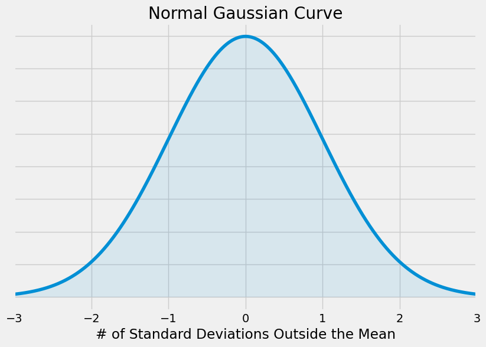
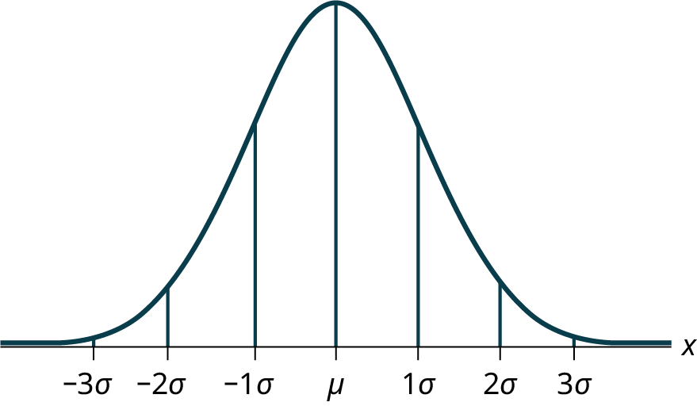
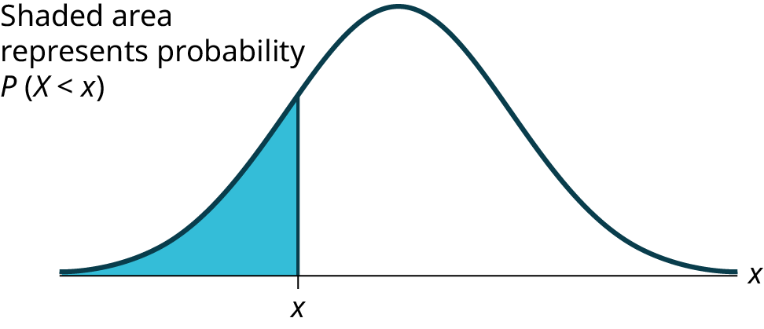

## Gaussian Distribution

A bell curve, Gaussian distribution, and normal distribution all refer to a curve with a characteristic bell shape, that is symmetric about the mean and extends indefinitely in both directions.



The curve is symmetric about a vertical line drawn through the mean, $\mu$. The normal distribution depends only on the mean and the standard deviation. Since the area under the curve must equal one, a change in the standard deviation, $\sigma$, causes a change in the shape of the curve. The curve becomes fatter or skinnier depending on $\sigma$. A change in $\mu$ causes the graph to shift to the left or right. This means there are an infinite number of normal probability distributions. One of special interest is called the standard normal distribution.

The probability density function is a rather complicated mathematical function. For an introductory engineering student, you do not need to memorize it.

$$ f(x)=\frac{1}{\sigma\sqrt{2\pi}}e^{-\frac{1}{2}[\frac{(x-\mu)}{\sigma}]^{2}} $$

The cumulative distribution function is P(X < x). It is calculated either by a calculator or a computer, or it is looked up in a table.

### Z-Scores

The standard normal distribution is a normal distribution of standardized values called _z-scores_. A z-score is measured in units of the standard deviation. For example, if the mean of a normal distribution is five and the standard deviation is two, the value 11 is three standard deviations above (or to the right of) the mean. The calculation is as follows:

$$ x = \mu + (z)(\sigma) = 5 + (3)(2) = 11 $$

In this case, the z-score is 3 for an x value of 11.

The mean $\mu$ for the standard normal distribution is zero, and the standard deviation $\sigma$ is one. The equation for the z-transformation is below:

$$ z =  \frac{x-\mu}{\sigma} $$

The value $x$ in the given equation comes from a normal distribution with mean $\mu$ and standard deviation $\sigma$. $z$ is the z-score of a particular value of $x$.

```{card} **Worked Example**
**GIVEN:**

$X$ is a normally distributed random variable with mean $\mu$ = 5 and standard deviation $\sigma$ = 6. Suppose $x$ = 17.

**FIND:**

The z-score for $x$ and the number of standard deviations $x$ is outside the mean.

**SOLUTION:**

**Z-score**

mean $\mu$ = 5

standard deviation $\sigma$ = 6

given value $x$ = 17

$$ z =  \frac{x-\mu}{\sigma} = \frac{17-5}{6} $$

$$ z = –0.67 $$

The z-score of $x$ = 17 is $z$ = -0.67

**Number of standard deviations outside the mean**

A z-score of $z$ = -0.67 means that $x$ = 17 is 0.67 of a standard deviations below, or to the left of the mean.

```

### The Empirical Rule

If X is a random variable and has a normal distribution with mean $\mu$ and standard deviation $\sigma$, then the Empirical Rule states the following:

 * About 68% of the x values lie between –1$\sigma$ and +1$\sigma$ of the mean $\mu$ (within one standard deviation of the mean).
 * About 95% of the x values lie between –2$\sigma$ and +2$\sigma$ of the mean $\mu$ (within two standard deviations of the mean).
 * About 99.7% of the x values lie between –3$\sigma$ and +3$\sigma$ of the mean $\mu$ (within three standard deviations of the mean). Notice that almost all the x values lie within three standard deviations of the mean.
 * The z-scores for +1$\sigma$ and –1$\sigma$ are +1 and –1
 * The z-scores for +2$\sigma$ and –2$\sigma$ are +2 and –2
 * The z-scores for +3$\sigma$ and –3$\sigma$ are +3 and –3

```{note}
The empirical rule is also known as the 68-95-99.7 rule
```


Image Credit: Introductory Statistics 2e Barbara Illowsky and Susan Dean

### Calculations of Probabilities

The normal distribution curve can be used to calculate probabilities.

The shaded area in the following graph indicates the area to the left of x. This area is represented by the probability P(X < x). Normal tables, computers, and calculators provide or calculate the probability P(X < x).


Image Credit: Introductory Statistics 2e Barbara Illowsky and Susan Dean

Remember, P ( X < x ) = Area to the left of the vertical line through x (the shaded area). The area to the right, the unshaded area, is then P ( X > x ) = 1 – P ( X < x ).

P ( X > x ) = 1 – P ( X < x ) = Area to the right of the vertical line through x.

P ( X < x ) is the same as P ( X $\leq$ x ) and P ( X > x ) is the same as P ( X $\geq$ x ) for continuous distributions.
