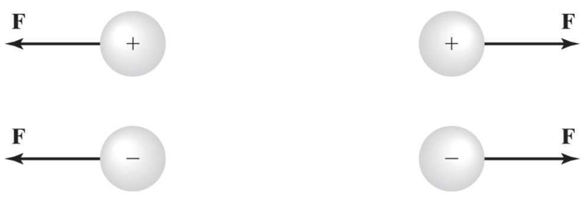
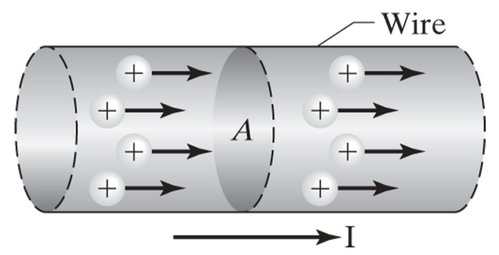

## Electricity Basics

### Learning Objectives

By the end of this section you will be able to:

 * Describe the concept of electric charge
 * Describe electrical potential or voltage
 * Describe the flow of electric change that produces electric current

### Electric Charge

The smallest amount of electric charge that can exist is that of a single electron which has a charge of $1.602 \times 10^{-19}$ C

A constant charge is usually denoted by Q, while a charge that changes with time is written as q or q(t).

Charge can be either positive or negative.

Dissimilar charges attract

Similar charges repel

By the Electrostatic Force

 * When a particle has equal parts positive and negative charge it is electrically neutral.
 * When there is an imbalance, the particle is electrically charged.
 * In conductors, a significant number of charged particles are free to move.
 * When charge moves through a material, an electric current exists in the material.  
 * However, unless an external force is applied, the electric charges in a conductor move about at random in an electric field.

### Voltage

 * Once an electromotive force is applied, charges move in a unified manner.
 * The electric potential difference, or voltage V, between two points is work done in moving a charge from one point to the other. 
 * The instantaneous voltage $v$ is described as a derivative

$$ v = \frac{dw}{dq} $$

 * In SI the unit for electric potential is the volt, $V$

$$ 1 \ V = \frac{1 \ J}{1 \ C} $$

### Current

Electric current, $I$, is the rate at which charge flows through an area.

$$ I_{avg} = \frac{\delta q}{\delta t} $$

The instantaneous current is written as a derivative

$$ i = \frac{dq}{dt} $$

The SI unit for electric current is the ampere (A) and it is defined as

$$ 1 \ A = \frac{1 \ C}{1 \ s} $$

#### Convensional Current

Conventional Current – based on the flow of positive charges, flows from positive to negative.

Conventional current is generally used in circuit analysis.

#### Electron Current

Electron Current – the movement of free electrons from negative to positive.

#### Direct Current

Direct Current (DC) - direction of charge flow is always the same

#### Alternating Current

Alternating Current (AC) - direction of charge flow alternates in direction, often sinusoidal.
