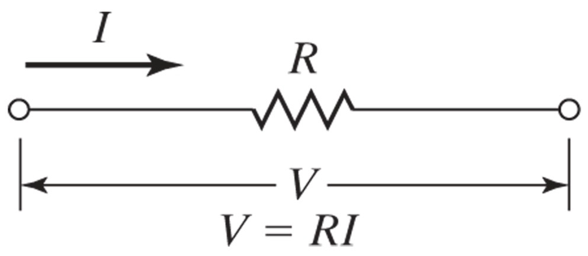
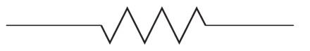
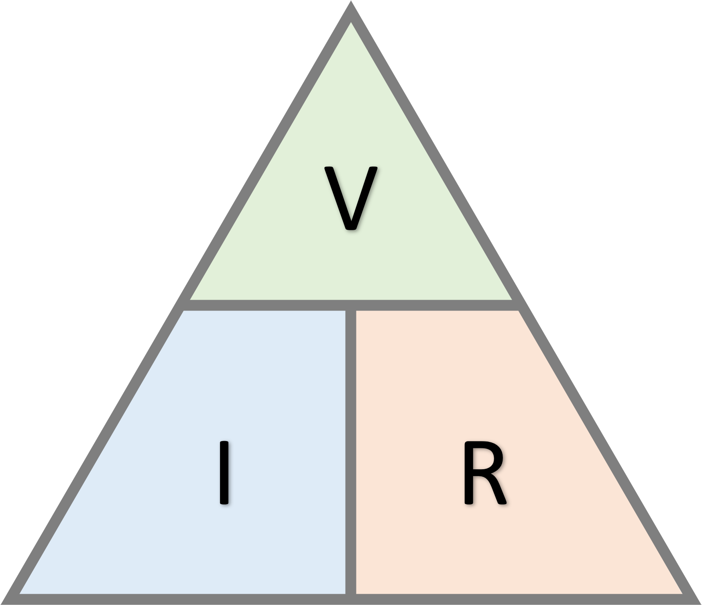

## Ohm's Law

### Learning Objectives

By the end of this section, you will be able to:

 * Describe Ohm's Law
 * Re-write Ohm's Law in three ways that solves for voltage, current, and resistance.
 * Recognize how to solve for voltage, current, and resistance.

### Ohm's Law

Ohm's Law states that the potential difference across a conductor is directly proportional to the current.

$$ V \propto I $$

Where $V$ is the potential difference and $I$ is the current.

Introducing a constant of proportionality $R$, denoting resistance, Ohm's law can be writen as:

$$ V = IR $$

### Resistance

Electrical resistance, $R$,  is an impedance to current flow through a circuit.

By rearranging Ohm's law, the resistance between any two points of a conductor is determined by applying a potential difference ($V$)  between those two points and measuring the current, $I$, that results.

$$ R = \frac{V}{I} $$

The SI unit for resistance is ohm ($\Omega$)

$$ 1 \ \Omega = \frac{1 \ V}{1 \ A} $$

### Voltage, Current, and Resistance

Using Ohm's Law, any one of voltage, current or resistance can be represented in terms of the other two.

A triangle with voltage ($V$), current ($I$), and resistance ($R$) shown below can be helpful to remember these relationships.

$$ V = IR $$

$$ I = \frac{V}{R} $$

$$ R = \frac{V}{I} $$

It is often necessary to find the equivalent or total resistance of two or more resistors connected together. Two ways to connect resistors together is in _series_ or in _parallel_. Combinations of resistors will be addressed in the next section.
