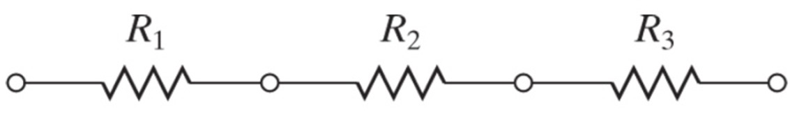
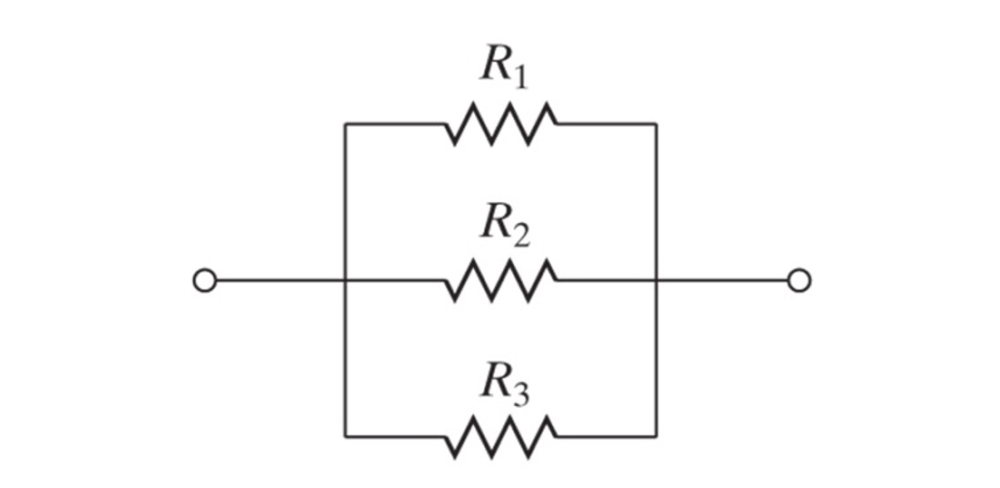

## Combining Resistors

Complex circuit diagrams can be combined by grouping series and parallel resistors. At each step of the process either a group of resistors in series or a group of resistors in parallel can be simplified and represented as one resitor. At the end of the simplificiation, one is left with a circuit diagram that contains one voltage source and one total resistance.

### Resistors in Series



$$ R_t = R_1 + R_2 + R_3 + \ldots + R_n $$

```{card} **Worked Example**
**GIVEN:**

Three resistors are connected in series.

$R_1 = 10 \ \Omega$, $R_2 = 20 \ \Omega$, $R_3 = 30 \ \Omega$

**FIND:**

The total resistance of the three resistors connected together, $R_t$

**SOLUTION:**

$$ R_t = R_1 + R_2 + R_3 $$

$$ R_t = 10 \ \Omega + 20 \ \Omega + 30 \ \Omega $$

$$ R_t = 50 \ \Omega $$

```

### Resistors in Parallel



$$ \frac{1}{R_t} = \frac{1}{R_1} + \frac{1}{R_2} + \frac{1}{R_3} + \ldots + \frac{1}{R_n} $$

```{card} **Worked Example**
**GIVEN:**

Three resistors are connected in parallel.

$R_1 = 10 \ \Omega$, $R_2 = 20 \ \Omega$, $R_3 = 30 \ \Omega$

**FIND:**

The total resistance of the three resistors connected together, $R_t$

**SOLUTION:**

$$ \frac{1}{R_t} = \frac{1}{R_1} + \frac{1}{R_2} + \frac{1}{R_3} $$

$$ \frac{1}{R_t} = \frac{1}{10 \ \Omega} + \frac{1}{20 \ \Omega} + \frac{1}{30 \ \Omega} $$

$$ \frac{1}{R_t} = \frac{6}{60 \ \Omega} + \frac{3}{60 \ \Omega} + \frac{2}{60 \ \Omega} = \frac{11}{60 \ \Omega} $$

$$ R_t = \frac{60}{11} \Omega \approx 5.45 \ \Omega $$

```
