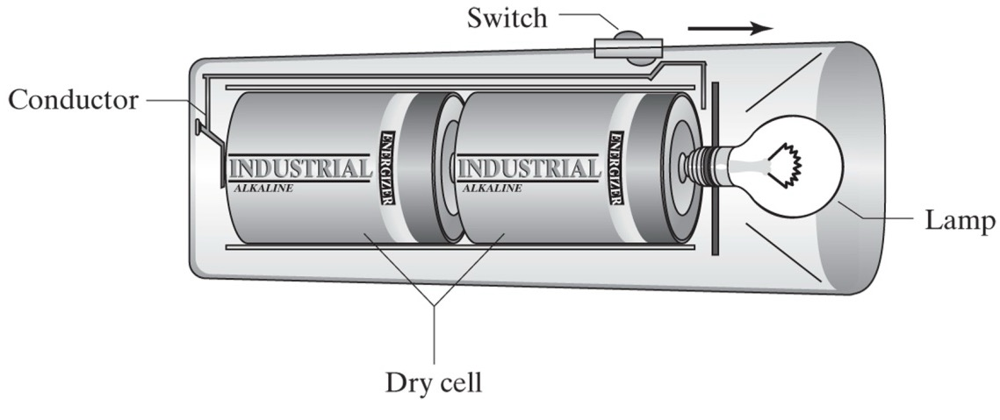
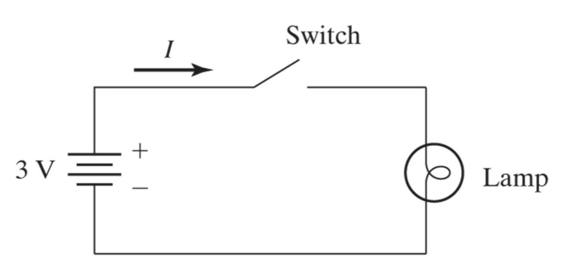
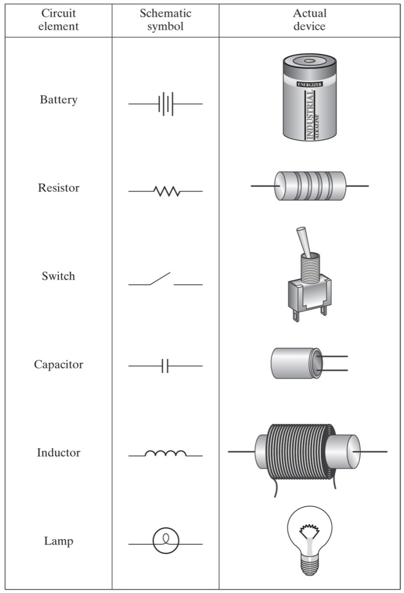
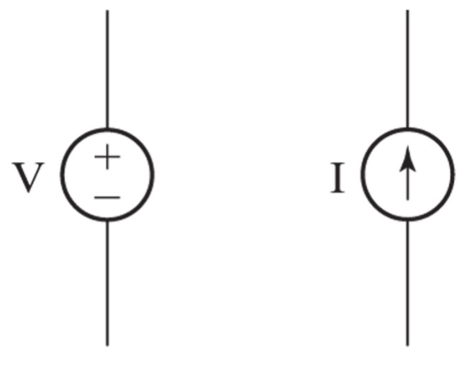

## Circuit Schematics

A schematic diagram is a symbolic representation of the devices and interconnections in the circuit.

The flashlight above can be represented in a schematic diagram

A circuit element is a generic term that refers to an electrical component such as a resistor, capacitor, or inductor. Circuit elements can be represented by circuit symbols in circuit schematic diagrams.

A few common circuit elements and their symbols are shown below.

In addition to the circuit element symbols above, there are also idealized independent voltage and current sources.

Schematic circuit elements can be combined to create schematic circuits.
