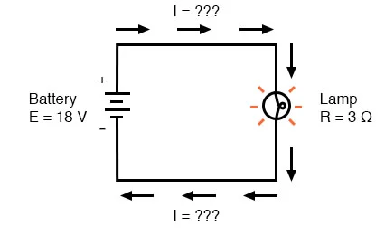

## Power

The electric potential difference, or voltage $V$, between two points is work done in moving a charge from one point to the other.

$$ V = \frac{dw}{dq} $$

By definition the rate at which work is done is power, $P$.

$$ P = \frac{dw}{dt} $$

Using the definition of instantaneous voltage, and rearranging to solve for the change in work $dw$:

$$ dw = vdq $$

The change in work, $dw$ per unit time $dt$ is therefore:

$$ \frac{dw}{dt} = v \frac{dq}{dt} $$

But remember, the definition of current is $i=\frac{dq}{dt}$, thus _Power_ can be written as:

$$ P = vi $$

For simpler DC-steady state circuits:

$$ P = VI $$

### Units of Power

Power is equal to voltage times current.

$$ P = VI $$

SI units for voltage $V$ are $[\frac{J}{C}]$ and the SI units for current $I$ are $[\frac{C}{s}]$.

$$ P = \left[\frac{J}{C}\right]\left[\frac{C}{s}\right] $$

Canceling the units coulombs, $C$, power $P$ ends up in units of $[\frac{J}{S}]$. One joule ($J$) per second ($s$) is equal to one watt ($W$).

$$ P = \left[\frac{J}{s}\right] = [W] $$

### Power, Current, Voltage and Resistance

When current flows through a resistor, the absorbed electrical energy is dissipated as thermal energy.  

The rate at which this occurs is referred to as power dissipation.

$$ P = VI $$

Using Ohm's law, two alternate forms relating power to current, resistance, and voltage can be created using

Ohm's law as $V = IR$

$$ P = I^{2}R $$

Ohm's law as $I=\frac{V}{R}$

$$ P = \frac{V^2}{R} $$

The image below shows how power, voltage, current and resistance can all be related.


Image Credit: WireCharm, Creative Commons Attribution 3.0 License

```{card} **Worked Example**
**GIVEN:**

The circuit diagram below:



Image Credit: Applied Industrial Electricity, Design Science License

In the above circuit, we know we have a battery voltage of 18 volts and a lamp resistance of 3 $\Omega$. 

**FIND:**

The electrical power disspated by the lap, $P_l$


**SOLUTION:**

In the above circuit, we know we have a battery voltage of 18 volts and a lamp resistance of 3 $\Omega$. Using Ohm's Law to determine current, we get:

$$
I = \frac{V}{R} = \frac{18 V}{3 \Omega} = 6 A
$$

Now that we know the current, we can take that value and multiply it by the voltage to determine power:

$$
P = VI = (18 V)(6 A) = 108 W
$$
 

This tells us that the lamp is dissipating (releasing) 108 watts of power, most likely in the form of both light and heat.

$$
P_l = 108 W
$$

```
