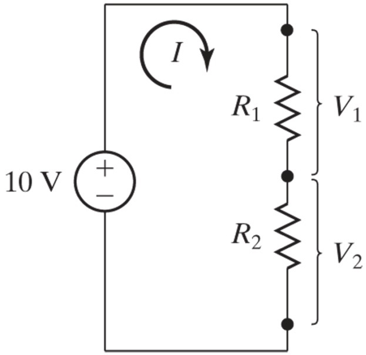

## Kirchhoff's Laws

### Learning Objectives

By the end of this section, you will be able to:

 * Describe Kirchhoff's current law
 * Describe Kirchhoff's voltage law
 * Use Kirchhoff's current and voltage laws to analyze complex circuits

### Kirchhoff's Laws

Many complex circuits cannot be analyzed with the series-parallel techniques developed in the preceding sections. In this section, we elaborate on the use of Kirchhoff's rules to analyze more complex circuits. Kirchoff's current and voltage laws will allow us to annalyze the currents flowing in and out of junctions, also called nodes and allow us to annalyze the voltage changes around any loop.

Kirchhoff's current law: The sum of all currents entering a junction must equal the sum of all currents leaving the junction:

$$
\sum I_{\mathrm{in}}=\sum I_{\mathrm{out}}
$$

Kirchhoff’s Voltage Law: The algebraic sum of changes in potential around any closed circuit path (loop) must be zero:

$$
\sum V_{loop}=0
$$

We now provide explanations of these two rules, followed by problem-solving hints for applying them and a worked example that uses them.

### Kirchhoff's Current Law

Kirchhoff's Current Law states that the algebraic sum of the currents entering a node is zero. Kirchhoff's Current Law is also sometimes called the junction rule because a node is also sometimes called a junction.

Kirchhoff's junction rule applies to the charge entering and leaving a junction or node. A junction, or node, is a connection of two or more wires. Current is the flow of charge, and charge is conserved; thus, whatever charge flows into the junction or node must flow out.

$$
\sum I_{\mathrm{in}}=\sum I_{\mathrm{out}}
$$

$$
\sum I_{\mathrm{in}}= I_1 + I_2 - I_3 + I_4 - I_5 = 0
$$

Although it is an over-simplification, an analogy can be made with water pipes connected in a plumbing junction. If the wires were replaced by water pipes, and the water was assumed to be incompressible, the volume of water flowing into the junction must equal the volume of water flowing out of the junction.

### Kirchhoff’s Voltage Law

Kirchhoff's Voltage Law states that the algebraic sum of the voltages around a loop is zero. Kirchhoff's Voltage Law is also sometimes called Kirchhoff's second rule or the loop rule because it applies to voltages around a loop.

$$
\sum V=0
$$

$$
\sum V= +10V - V_1 - V_2 = 0
$$

Kirchhoff's voltage law or loop rule applies to potential differences. The loop rule is stated in terms of potential voltage rather than potential energy, but the two are related. In a closed loop, whatever energy is supplied by a voltage source, the energy must be transferred into other forms by the devices in the loop, since there are no other ways in which energy can be transferred into or out of the circuit. Kirchhoff's loop rule states that the algebraic sum of potential differences, including voltage supplied by the voltage sources and resistive elements, in any loop must be equal to zero.
