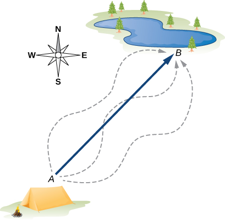

## Vectors and Scalars

A scalar is a quantity having a magnitude, but no direction. A vectors has both a magnitude and a direction.

### Scalars

Many familiar physical quantities can be specified completely by giving a single number and the appropriate unit. For example, "a class period lasts 50 min" or "the gas tank in my car holds 65 L" or "the distance between two posts is 100 m." A physical quantity that can be specified completely in this manner is called a _scalar_ quantity. Scalar is a synonym of “number.” Time, mass, distance, length, volume, temperature, and energy are examples of scalar quantities.

 > Example: Speed is a scalar

 The items in the table below are all scalars:

 | scalars |
 | --- |
 | time |
 | distance |
 | length |
 | speed |
 | mass |
 | volume |
 | temperature |
 | work |
 | energy |

 Scalar quantities that have the same physical units can be added or subtracted according to the usual rules of algebra for numbers. For example, a class ending 10 min earlier than 50 min lasts  50min − 10min = 40min. Similarly, a 60-cal serving of corn followed by a 200-cal serving of donuts gives  60 cal + 200 cal = 260 cal of energy.
 
 When we multiply a scalar quantity by a number, we obtain the same scalar quantity but with a larger (or smaller) value. For example, if yesterday’s breakfast had 200 cal of energy and today’s breakfast has four times as much energy as it had yesterday, then today’s breakfast has  4(200 cal) = 800 cal of energy.
 
 Two scalar quantities can also be multiplied or divided by each other to form a derived scalar quantity. For example, if a train covers a distance of 100 km in 1.0 h, its speed is 100.0 km/1.0 h = 27.8 m/s, where the speed is a derived scalar quantity obtained by dividing distance by time.

### Vectors

A vector is a quantity having both magnitude and direction.

Many physical quantities, however, cannot be described completely by just a single number of physical units. For example, when the U.S. Coast Guard dispatches a ship or a helicopter for a rescue mission, the rescue team must know not only the distance to the distress signal, but also the direction from which the signal is coming so they can get to its origin as quickly as possible.

Physical quantities specified completely by giving a number of units (magnitude) and a direction are called vector quantities. 

 > Example: Velocity is a vector
 
 The items in the table below are all vectors:
 
 | vectors|
 | --- |
 | displacement |
 | velocity |
 | acceleration |
 | position |
 | force |
 | torque |
 | stress |
 | moment |
 | momentum |
 | impulse |

### Vector Example

Displacement is a general term used to describe a change in position, such as during a trip from the tent to the fishing hole. Displacement is an example of a vector quantity. If you walk from the tent (location A) to the hole (location B), as shown in Figure 2.3, the vector **D**, representing your displacement, is drawn as the arrow that originates at point A and ends at point B. The arrowhead marks the end of the vector. The direction of the displacement vector **D** is the direction of the arrow. The length of the arrow represents the magnitude D of vector D.

Here, D = 6 km. Since the magnitude of a vector is its length, which is a positive number, the magnitude is also indicated by placing the absolute value notation around the symbol that denotes the vector; so, we can write equivalently that D = |**D**|.

To solve a vector problem graphically, we need to draw the vector **D** to scale. For example, if we assume 1 unit of distance (1 km) is represented in the drawing by a line segment of length u = 2 cm, then the total displacement in this example is represented by a vector of length d = 6u = 6(2cm) = 12cm.

Notice that here, to avoid confusion, we used D = 6km to denote the magnitude of the actual displacement and d = 12 cm to denote the length of its representation in the drawing.

