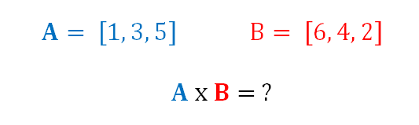

## Exersizes

1. Determine the $x$ and $y$ components of the vector shown below. Assume the vertical axis is the y-axis and the horizontal axis is the x-axis. Note the magnitude and angle shown in the picture.

2. The velocity vector of the hockey puck shown below is given in component form. Determine the magnitude and direction of the velocity with respect to the axes given.

3. A cable as shown below is used to tether the top of a pole to a point on the ground. The cable has a tension force of 3 kN that acts along the direction of the cable as shown below. What are the  $𝑥$, $𝑦$, and $𝑧$ components of the tension force acting on the top of the pole?

4. Determine the sum of the force vectors in the diagram below. Leave the sum in component form.

5. Find the dot product of force vector $\vec{F_A}$ with the given unit vector $\hat{B}$ shown in the figure below.

6. Calculate the dot product of $\vec{A}$ and $\vec{B}$ shown below.

7. Calculate the cross product of force vectors $\vec{F_A}$ and $\vec{F_B}$ shown in the diagram below.

8. Calculate the cross product of the vectors $\vec{A}$ and $\vec{B}$ in the diagram below by hand.

Exersizes from Jacob Moore & Contributors

Pennsylvania State University Mont Alto via Mechanics Map
