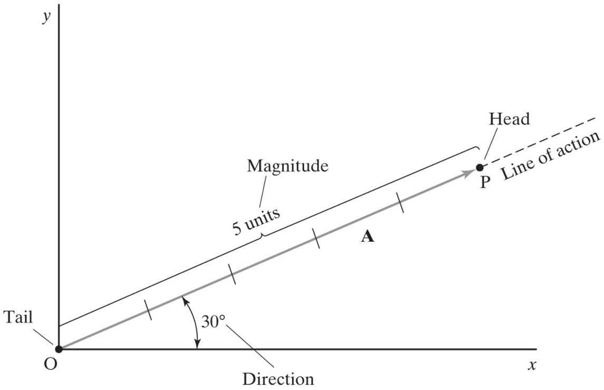

## Vector Notation

In print, vectors as commonly denoted with bold faced type, **A** or an identifying arrow above them such as:

$$ \vec{A} $$

Hat notation (also called a circumflex) is typically reserved for unit vectors. Unit vectors are vectors that have a mangnitude of 1.

$$ \hat{u} $$

The magnitude of a vector is usually written with absolute value notation although in type it is sometime written as A (no arrow, not bold).

$$ \lvert\vec{A}\rvert $$

### Drawing Vectors

Drawn from an initial point (tail) to the terminal point (head) along a line of action.

$$ \vec{A} = \vec{OP} $$
