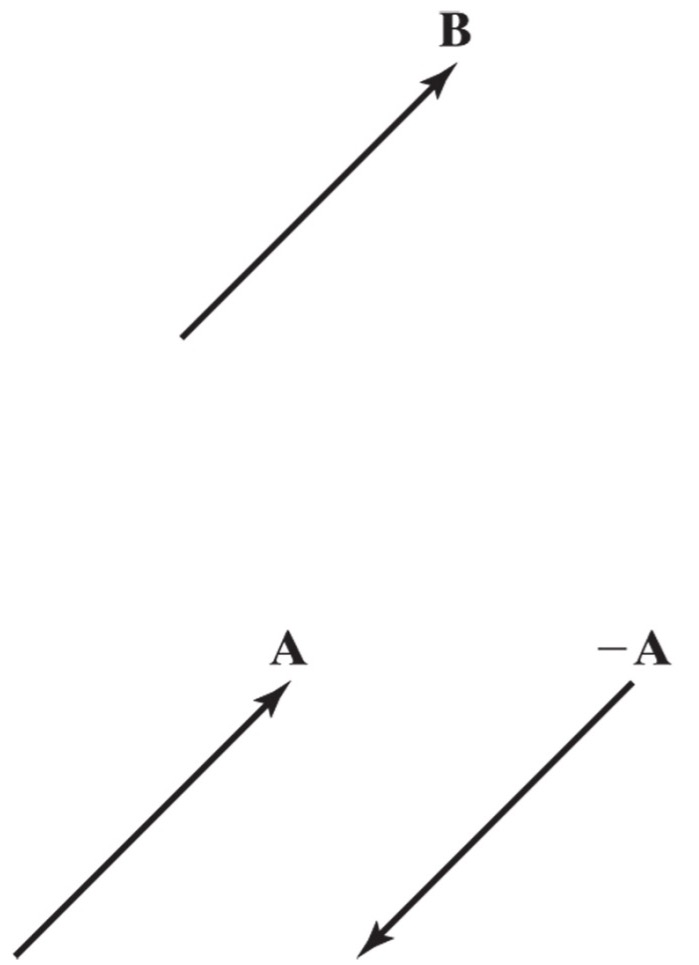
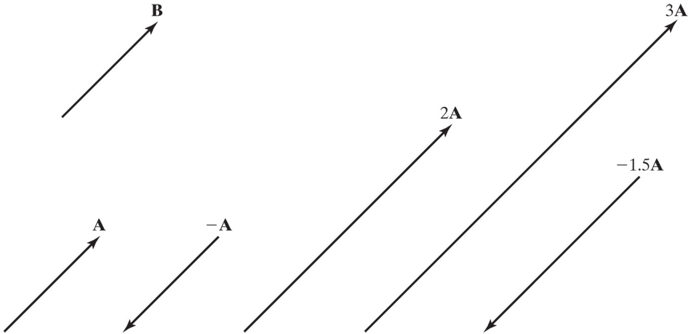
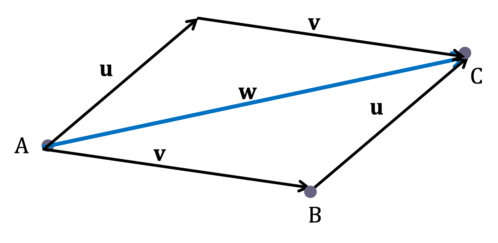

## Vector Addition and Multiplication

### Properties of Vectors

Two vectors are equivalent (or equal) if they have the same direction and magnitude.

$$ \vec{A} = \vec{B} \ and \ \vec{A} \neq -\vec{A} $$

### Vector multiplied by a scalar

If c is a scalar and **v** is a vector, then the scalar multiple c**v** is the vector whose length is ∣c∣ times the length of **v** and whose direction is the same as **v** if c>0, and opposite if c<0.  If c = 0 or **v** = 0, then c**v** = 0.

### Vector Addition

If **u** and **v** are vectors positioned so the initial point of **v** is at the terminal point of **u**, then the sum of **u** + **v** is the vector from the initial point of **u** to the terminal point of **v**.

This is sometimes called the head-to-tail method as the head of **u** is attached to the tail of **v** and the resulting sum is from the tail of **u** to the head of **v**.

$$ \vec{u} + \vec{v} = \vec{w} $$

Vector addition is communitive. The order of adding vectors does not matter.

$$ \vec{v} + \vec{u} = \vec{w} $$

### Scalar multiplication

Multiplying a vector by a scalar only changes the magnitude (and not the direction) of a vector. If the scalar is negative, the line of action of the vector remains the same, but the vector points in the opposite direction. If the scalar is zero, the resulting vector has zero magnitude.
