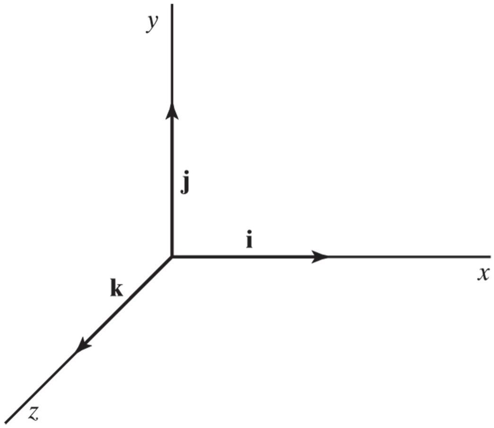
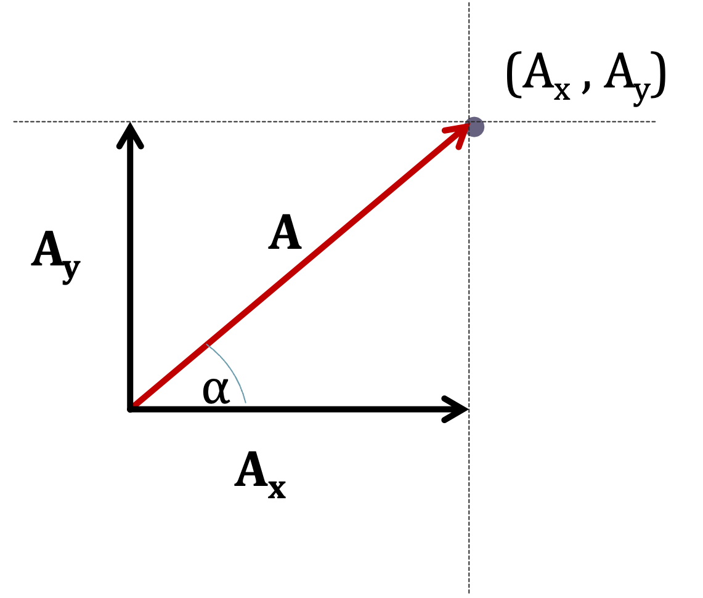

## Unit Vectors

A unit vector is a vector of unit length (magnitude of 1) used to specify a given direction.

The most common are the Cartesian unit vectors $\hat{i}$, $\hat{j}$, and $\hat{k}$.

$$ \hat{i} = \langle1,0,0\rangle $$

$$ \hat{j} = \langle0,1,0\rangle $$

$$ \hat{k} = \langle0,0,1\rangle $$

In a 2-D Cartesian system, $\vec{A}$ can be written in either matrix form

$$ \vec{A} = A\langle\cos\alpha,\sin\alpha\rangle $$

$$ \vec{A} = \langle A\cos\alpha,A\sin\alpha\rangle $$

Or unit vector notation form (also called $\hat{i}$, $\hat{j}$, $\hat{k}$ notation), Where A is the magnitude of $\vec{A}$

$$ \vec{A} =A(\cos{\alpha}\hat{i} + \sin{\alpha}\hat{j}) $$

$$ \vec{A} =A\cos{\alpha}\hat{i} + A\sin{\alpha}\hat{j} $$

$$ \vec{A} =A_x\hat{i} + A_y\hat{j} $$
