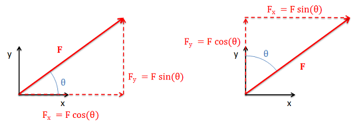

## 2D Vectors

To represent a vector quantity, we will generally have two options. These two options are:

 * Magnitude and Direction Form: Where the magnitude is given as a single quantity and the direction is given via an angle or combination of angles.
 * Component Form: Where the magnitude and direction are given through component magnitudes in each coordinate direction.

### Magnitude and Direction Form

The magnitude and direction form of vector quantities are often used at the start and end of a problem. This is because it is often easier to measure things likes forces and velocities as a magnitude and direction at the start of a problem, and it is often easier to visualize the final result as a magnitude and direction at the end. Vectors represented as a magnitude and direction need to be shown visually through the use of an arrow, where the magnitude is the length of the arrow, and the direction is shown through the arrow head and an angle or angles relative to some known axes or other direction.

$$ \vec{F} = 70 \text{ lbs at 15 degrees (+CW relative to the -x axis)} $$

### Component Form

The component form of a vector is often used in middle of the problem because it is far easier to do math with vector quantities in component form. Vectors can be represented in component form in one of two ways. First we can use square brackets to indicate a vector, with the x, y, and possibly z components separated by commas.

Alternatively, we can write out a vector in component form using the magnitudes in front of unit vectors to indicate directions (generally the $\hat{i}$, $\hat{j}$, and $\hat{k}$ unit vectors for the $x$, $y$, and $z$ directions respectively).

Neither of these component forms relies on a visual depiction of the vector as with the magnitude and direction form, though it is important to clearly identify the coordinate system in earlier diagrams.

$$
 \begin{matrix}
{\text{Bracket or Matrix Notation:}\quad} & \vec{F} = \langle3,4,5\rangle \\
{\text{Unit Vector or i,j,k Notation:}\quad} & {\,\overset{\rightarrow}{F} = 3\hat{i} + 4\hat{j} + 5\hat{k}}
\end{matrix}
$$

### Converting Between Vector Representations in 2D

It is often advantageous to have the vectors in one form or the other, and will therefore need to convert the vector from a magnitude and direction to component form or vice versa. To do this we will use right triangles and trigonometry.

#### Magnitude and Direction Form to Component Form

To go from a magnitude and direction to component form, we will first draw a right triangle with the hypotenuse being the original vector. The horizontal arm of the triangle will then be the  x-component of the vector while the vertical arm is the y component of the vector. If we know the angle of the vector with respect to either the horizontal or the vertical, we can use the sine and cosine relationship to find the  x and  y components.

Image Credit: https://eng.libretexts.org/Bookshelves/Mechanical_Engineering/Mechanics_Map_(Moore_et_al.)/16%3A_Appendix_1_-_Vector_and_Matrix_Math/16.1%3A_Vectors

It is important to remember that how we measure the angle will affect the sine and cosine relationships. Multiplying the magnitude by the sine will always give us the opposite leg and multiplying the magnitude by the cosine will always give us the adjacent leg.

Image Credit: https://eng.libretexts.org/Bookshelves/Mechanical_Engineering/Mechanics_Map_(Moore_et_al.)/16%3A_Appendix_1_-_Vector_and_Matrix_Math/16.1%3A_Vectors

#### Component Form to Magnitude and Direction Form

To find the magnitude and the direction of a vector using components, we will use the same process in reverse. We will draw the components as the legs of a right triangle, where the hypotenuse of the triangle shows the magnitude and direction of the vector.

To find the magnitude of the vector we will use the Pythagorean Theorem, taking the square root of the sum of the squares of each component. To find the angle, we can easily use the inverse tangent function, relating the opposite and adjacent legs of our right triangle.

Image Credit: https://eng.libretexts.org/Bookshelves/Mechanical_Engineering/Mechanics_Map_(Moore_et_al.)/16%3A_Appendix_1_-_Vector_and_Matrix_Math/16.1%3A_Vectors

If we know the magnitude of the hypotenuse, we can also use the inverse sine and cosine functions in place of the inverse tangent function to find the angle. As with the previous conversion, it is important to clearly identify the opposite leg, the adjacent leg, and the hypotenuse in our diagrams and to think of these when applying the inverse trig functions.
