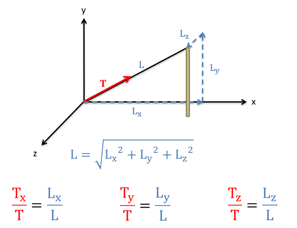

## 3D Vectors

### Method for Finding 3D Vector Components

In three dimensions, we will have either three components (x, y, and z) for component form or a magnitude and two angles for the direction in magnitude and direction form. To convert between forms we will need to draw in two sets of right triangles. The hypotenuse of the first triangle will be the original vector and one of the legs will be one of the three components. The other leg will then be the hypotenuse of the second triangle. The legs of this second triangle will then be the remaining two components as shown in the diagram below. Use sine and cosine relationships to find the magnitude of each component along the way. This general process of two consecutive right triangles will always hold true, but depending on angles that are given or chosen which components end up being which leg can vary. Carefully plotting everything out in a diagram is important for this reason.

Image Credit: https://eng.libretexts.org/Bookshelves/Mechanical_Engineering/Mechanics_Map_(Moore_et_al.)/16%3A_Appendix_1_-_Vector_and_Matrix_Math/16.1%3A_Vectors

To go from component form back to a magnitude and direction, we will use the 3D form of the Pythagorean Theorem (the magnitude will be the square root of the sum of the three components squared) and we can again use the inverse trig functions to find the angles. We simply need to work backwards through the two right triangles in our problem, so again it is important to carefully draw out your diagrams.

### Alternative Method for Finding 3D Vector Components

Sometimes, as with the tension in a cable, the geometry of the cable is given in component form rather than as angles. In cases such as this we could use geometry to figure out the angles and then use those angles to figure out the components, but there is a mathematical shortcut that will allow us to solve for the components more quickly involving the ratio of lengths. Specifically, the ratios of the components of the cable length to the overall length of the cable will be the same as the ratio of the corresponding force components to the overall magnitude of the force.

To use this method we will first need to find the overall length of the cable (or other physical geometric feature) using the Pythagorean Theorem. Once we have that overall length, we find a ratio by taking the x component of the length divided by the overall length. To find the x-component of the force, we simply multiply the overall magnitude of the force by this ratio of lengths ($L_x/L$). The process for the y and z components follows a similar path, except the ratios would include the y and  z component lengths instead of the x-component.

Image Credit: https://eng.libretexts.org/Bookshelves/Mechanical_Engineering/Mechanics_Map_(Moore_et_al.)/16%3A_Appendix_1_-_Vector_and_Matrix_Math/16.1%3A_Vectors
