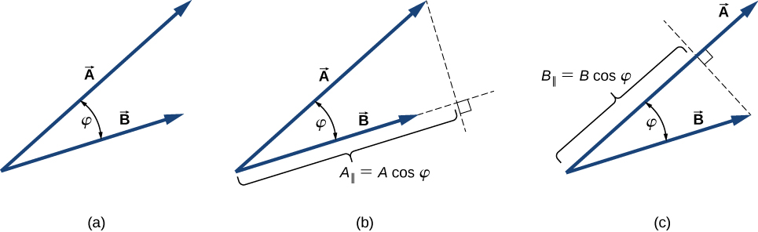
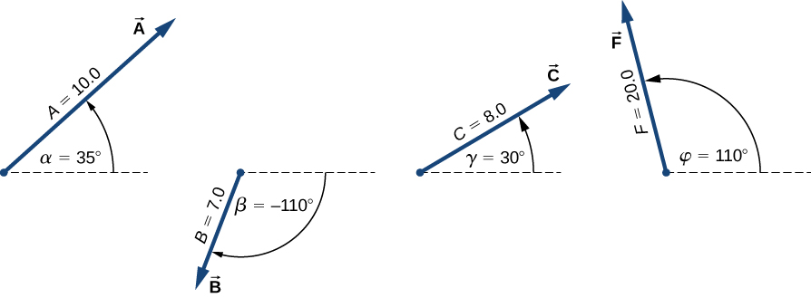

## Dot Product

### Learning Objectives

By the end of this section, you will be able to:

 * Explain the difference between the dot product and cross product of two vectors
 * Calculate the dot product of two 2D vectors
 * Calculate the dot product of two 3D vectors
 * Use the dot product to find the angle between two vectors
 * Describe how the dot product is used in Engineering

### Vector Products

There are two kinds of products of vectors used broadly in engineering. One kind of multiplication (product of two vectors) is a scalar multiplication of two vectors. Taking a scalar product of two vectors results in a scalar, as its name indicates. Scalar products, also called the _dot product_ are used to define work and energy relations. For example, the work that a force (a vector) performs on an object while causing its displacement (a vector) is defined as a scalar product of the force vector with the displacement vector.

A quite different kind of vector products is a vector multiplication of two vectors. Taking a vector product of two vectors produces a vector, as its name suggests. Vector products, also called the _cross product_ are used to define other derived vector quantities. For example, a vector quantity called torque is defined as the cross product of an applied force (a vector) and its distance from pivot to force (a vector).

It is important to distinguish between these two kinds of vector multiplications, the dot product and the cross product, because the dot product is a scalar quantity and the cross product is a vector quantity.

### Dot Product Definition

The scalar multiplication of two vectors, the dot product, yields a scalar product.

The scalar product $\vec{A}$ and $\vec{B}$ is defined by:

$$ \vec{A}\cdot\vec{B} = AB\cos{\theta} $$

Where $\theta$ is the angle between vectors $\vec{A}$ and $\vec{B}$ and $A$ and $B$ represent the magnitudes of vectors $\vec{A}$ and $\vec{B}$.

In the definition of the dot product, the direction of angle $\theta$ does not matter, and $\theta$ can be measured from either of the two vectors to the other because $cos{\theta} = \cos(-\theta) = \cos(2\pi-\theta)$.

 * The dot product is negative when $90^{\circ} < \theta \leq 180^{\circ}$
 * The dot product is positive when $0^{\circ} \leq \theta < 90^{\circ}$
 * The dot product of two parallel vectors is $\vec{A}\cdot\vec{A} = AB\cos{0^{\circ}} = AB$
 * The dot product of two antiparallel vectors (parallel vectors pointing in the opposite direction) is $\vec{A}\cdot\vec{A} = AB\cos{180^{\circ}} = -AB$
 * The dot product of two orthogonal vectors is zero:  $\vec{A}\cdot\vec{A} = AB\cos{90^{\circ}} = 0$
 * The dot product of a vector with itself is the square of its magnitude: $\vec{A}^2 = \vec{A}\cdot\vec{A} = A A \cos(0) = A^2$



Image: https://openstax.org/books/university-physics-volume-1/pages/2-4-products-of-vectors

```{card} Worked Example

**GIVEN**:

The vectors $\vec{A}$ and $\vec{F}$ shown below:



**FIND:**

The dot product of $\vec{A}$ and $\vec{F}$.

**SOLUTION:**

The magnitudes of $\vec{A}$ and $\vec{F}$ are known:

$$ \lvert\vec{A}\rvert = 10.0 $$

$$ \lvert\vec{F}\rvert = 20.0 $$

The angle $\theta$ between $\vec{A}$ and $\vec{F}$ is the difference between their angles +CCW relative to the +x-axis:

$$ \theta = \varphi - \alpha = 110^{\circ} - 35^{\circ} = 75^{\circ} $$

Calculate the dot product using the dot product formula

$$ \vec{A}\cdot\vec{F} = AF\cos{\theta} = (10.0)(20.0)\cos(75^{\circ}) = 51.8 $$

Credit: https://openstax.org/books/university-physics-volume-1/pages/2-4-products-of-vectors Example 2.15

```

### Commutative and Distributed Properties

The dot product is commutative. It does not matter which order vectors are in when calculating the dot product.

$$ \vec{A}\cdot\vec{B} = \vec{B}\cdot\vec{A} $$

The dot product obeys the distributed law:

$$ \vec{A}\cdot(\vec{B} + \vec{C}) = \vec{A}\cdot\vec{B} + \vec{A}\cdot\vec{C} $$

### Alternate Dot Product Definition

When the vectors in Equation 2.27 are given in their vector component forms:

$$ {\vec{A}= A_{x}\mathbf{\hat{i}} + A_{y}\mathbf{\hat{j}} + A_{z}\mathbf{\hat{k}}}\ \text{and}\ {\vec{B} = B_{x}\mathbf{\hat{i}} + B_{y}\mathbf{\hat{j}} + B_{z}\mathbf{\hat{k}}} $$

The dot product can be computed as below:

$$
\begin{array}{cll}
{\vec{A}\cdot\vec{B}} & = & {(A_{x}\mathbf{\hat{i}} + A_{y}\mathbf{\hat{j}} + A_{z}\mathbf{\hat{k}}) \cdot (B_{x}\mathbf{\hat{i}} + B_{y}\mathbf{\hat{j}} + B_{z}\mathbf{\hat{k}})} \\
 & = & {\mspace{11mu} A_{x}B_{x}\mathbf{\hat{i}} \cdot \mathbf{\hat{i}} + A_{x}B_{y}\mathbf{\hat{i}} \cdot \mathbf{\hat{j}} + A_{x}B_{z}\mathbf{\hat{i}} \cdot \mathbf{\hat{k}}} \\
 & & {+ A_{y}B_{x}\mathbf{\hat{j}} \cdot \mathbf{\hat{i}} + A_{y}B_{y}\mathbf{\hat{j}} \cdot \mathbf{\hat{j}} + A_{y}B_{z}\mathbf{\hat{j}} \cdot \mathbf{\hat{k}}} \\
 & & {+ A_{z}B_{x}\mspace{2mu}\mathbf{\hat{k}} \cdot \mathbf{\hat{i}} + A_{z}B_{y}\mathbf{\hat{k}} \cdot \mathbf{\hat{j}} + A_{z}B_{z}\mspace{2mu}\mathbf{\hat{k}} \cdot \mathbf{\hat{k}}.}
\end{array}
$$

Since the dot product of two unit vectors along perpendicular axes is zero, and the products of unit vectors with themselves is one, there are only three non-zero terms in this expression. Thus, the dot product formula simplifies to:

$$ \vec{A}\cdot\vec{B} = A_x B_x + A_y B_y + A_z B_z $$

We can use the dot product to find the angle between two vectors. Solving for $\cos\theta$:

$$ \cos\theta = \frac{\vec{A}\cdot\vec{B}}{A B} $$

Where $\vec{A}\cdot\vec{B}$ is the dot product of $\vec{A}$ and $\vec{B}$ and $A$ and $B$ are the magnitudes of $\vec{A}$ and $\vec{B}$. We can take the inverse $\cos$ to calculate angle $\theta$.

$$ \theta = \cos^{-1}\left[\frac{\vec{A}\cdot\vec{B}}{A B}\right] $$

```{card} Worked Example

**GIVEN**:

Three dogs are pulling on a stick in different directions, as shown in the figure below. 

The first dog pulls with force $\vec{F_1}=(10.0\hat{i}−20.4\hat{j}+2.0\hat{k})$ N, the second dog pulls with force $\vec{F_2}=(−15.0\hat{i}−6.2\hat{k})$ N, and the third dog pulls with force $\vec{F_3}=(5.0\hat{i}+12.5\hat{j})$ N.


**FIND:**

The angle between forces $\vec{F_1}$ and $\vec{F_2}$.
 
**SOLUTION:**

The magnitudes of $\vec{F_1}$ and $\vec{F_2}$ are:

$$ F_{1} = \sqrt{F_{1x}^{2} + F_{1y}^{2} + F_{1z}^{2}} = \sqrt{10.0^{2} + 20.4^{2} + 2.0^{2}}\ \text{N} = 22.8\ \text{N} $$

$$ F_{2} = \sqrt{F_{2x}^{2} + F_{2y}^{2} + F_{2z}^{2}} = \sqrt{15.0^{2} + 6.2^{2}}\ \text{N} = 16.2\ \text{N} $$

Calculate the dot product of $\vec{F_1}$ and $\vec{F_2}$ using the dot product component formula:

$$
\begin{array}{cl}
{\vec{F_1} \cdot \vec{F_2}} & {= F_{1x}F_{2x} + F_{1y}F_{2y} + F_{1z}F_{2z}} \\
 & {= (10.0\ \text{N})(-15.0\ \text{N}) + (-20.4\ \text{N})(0.0\ \text{N}) + (2.0\ \text{N})(-6.2\ \text{N})} \\
 & {= -162.4\ \text{N}^{2}}
\end{array}
$$

Substitute the result into the dot product angle formula:

$$ \text{cos}\ \varphi = \frac{\vec{F_1} \cdot \vec{F_2}}{F_{1}F_{2}} $$ 

$$ \text{cos}\ \varphi = \frac{-162.4\mspace{2mu} \ \text{N}^{2}}{(22.8\ \text{N})(16.2\ \text{N})} = -0.439 $$

$$ \varphi = \text{cos}^{-1}(-0.439) $$

$$ \varphi = 116.0^{\circ} $$

Credit: https://openstax.org/books/university-physics-volume-1/pages/2-4-products-of-vectors Example 2.16
```

```{card} Worked Example

**GIVEN**:

When force $\vec{F}$ acts on an object and causes the object to move displacement $\vec{D}$, we say the force performs work. The amount of work the force does is the dot product $\vec{F} \cdot \vec{D}$.


**FIND:**

If the stick in the image above moves momentarily and gets displaced by vector $\vec{D} =(−7.9 \hat{j} − 4.2 \hat{k})$ cm, how much work is done by the third dog that exerts $\vec{F_3} = (5.0 \hat{i} + 12.5 \hat{j})$ N?
 
**SOLUTION:**

Compute the dot product of displacement vector $\vec{D}$ with force vector $\vec{F_3} = (5.0 \hat{i} + 12.5 \hat{j})$ N, which is the force exerted by the third dog. Let's use $W_3$ to denote the work done by force $\vec{F_3}$ on displacement $\vec{D}$.

Calculate the dot product of $\vec{F_3}$ and $\vec{D}$:

$$
\begin{array}{cl}
W_{3} & {= \vec{F_3} \cdot \vec{D} = F_{3x}D_{x} + F_{3y}D_{y} + F_{3z}D_{z}} \\
 & {= (5.0\ \text{N})(0.0\ \text{cm}) + (12.5\ \text{N})(-7.9\ \text{cm}) + (0.0\ \text{N})(-4.2\ \text{cm})} \\
 & {= -98.7\ \text{N} \cdot \text{cm}.}
\end{array}
$$


$$ F_{1} = \sqrt{F_{1x}^{2} + F_{1y}^{2} + F_{1z}^{2}} = \sqrt{10.0^{2} + 20.4^{2} + 2.0^{2}}\ \text{N} = 22.8\ \text{N} $$

$$ F_{2} = \sqrt{F_{2x}^{2} + F_{2y}^{2} + F_{2z}^{2}} = \sqrt{15.0^{2} + 6.2^{2}}\ \text{N} = 16.2\ \text{N} $$

Calculate the dot product of $\vec{F_1}$ and $\vec{F_2}$ using the dot product component formula:

$$
\begin{array}{cl}
{\vec{F_1} \cdot \vec{F_2}} & {= F_{1x}F_{2x} + F_{1y}F_{2y} + F_{1z}F_{2z}} \\
 & {= (10.0\ \text{N})(-15.0\ \text{N}) + (-20.4\ \text{N})(0.0\ \text{N}) + (2.0\ \text{N})(-6.2\ \text{N})} \\
 & {= -162.4\ \text{N}^{2}}
\end{array}
$$

The SI unit of work is a joule ($J$) where 1 $J$ = 1 $N \cdot m$. The unit $cm \cdot N$ can be written as $10^{−2} m \cdot N = 10^{−2} \ J$, so the solution can be expressed as $W_3 = −0.9875 \ J \approx −1.0 \ J$.

Credit: https://openstax.org/books/university-physics-volume-1/pages/2-4-products-of-vectors Example 2.17
```

### Section Summary

 * The dot product of two vectors, also called the scalar product, is a scalar.
 * The dot product component formula is:

$$ \vec{A}\cdot\vec{B} = A_x B_x + A_y B_y + A_z B_z $$

 * The dot product angle formula is:

$$ \vec{A}\cdot\vec{B} = AB\cos{\theta} $$

 * The dot product angle formula and component formula can be used to calculate the angle between two vectors:

$$ \theta = \cos^{-1}\left[\frac{\vec{A}\cdot\vec{B}}{A B}\right] $$
