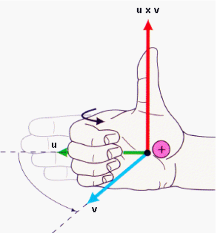
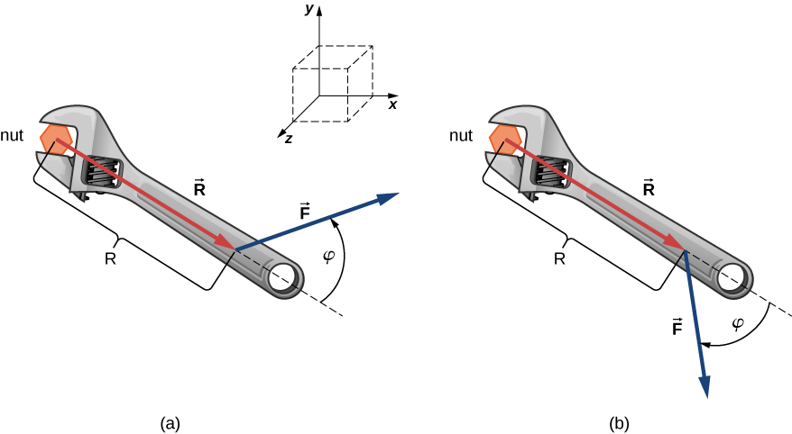

## Cross Product

The cross product is a combination of two vectors that produces a third vector. While the dot product produces a scalar output, the cross product produces a vector output.

The vector produced by the cross product is perpendicular to each of the vectors that forms the cross product. 

One form of the cross product is written as:

$$ \vec{A}\times\vec{B} =|A||B|\sin \theta\hat{n} $$

Where $\hat{n}$ is a unit vector perpendicular to both $\vec{A}$ and $\vec{B}$.

Another form of the cross product is written as:

$$
\vec{A} \times \vec{B} =
\begin{vmatrix}
    \hat{i} & \hat{j} & \hat{k} \\
    A_x & A_y & A_z \\
    B_x & B_y & B_z
\end{vmatrix} =
(A_{y}B_{z}-A_{z}B_{y})\hat{i} +
(A_{z}B_{x}-A_{x}B_{z})\hat{j} +
(A_{x}B_{y}-A_{y}B_{x})\hat{k}
$$

To make it easier to remember we can use the notation of determinants:

$$
\begin{vmatrix}
    a & b \\
    c & d
\end{vmatrix} = ad - bc
$$

A determinant of order 3 can be defined in term of second-order determinants as follows:

$$
\begin{vmatrix}
    a_1 & a_2 & a_3 \\
    b_1 & b_2 & b_3 \\
    c_1 & c_2 & c_3
\end{vmatrix} = a_1
\begin{vmatrix}
b_2 & b_3 \\
c_2 & c_3
\end{vmatrix} - a_2
\begin{vmatrix}
b_1 & b_3 \\
c_1 & c_3
\end{vmatrix} + a_3
\begin{vmatrix}
b_1 & b_2\\
c_1 & c_2
\end{vmatrix}
$$

Thus in determinant notation for the given vectors $\vec{A}$ and $\vec{B}$:

$$ \vec{A} = \langle A_x,A_y,A_z \rangle $$

$$ \vec{B} = \langle B_x,B_y,B_z \rangle $$

$$
\begin{vmatrix}
    \hat{i} & \hat{j} & \hat{k} \\
    A_x & A_y & A_z \\
    B_x & B_y & B_z
\end{vmatrix} =
\begin{vmatrix}
A_y & A_z \\
B_y & B_z
\end{vmatrix} \hat{i} -
\begin{vmatrix}
A_x & A_z \\
B_x & B_z
\end{vmatrix} \hat{j} +
\begin{vmatrix}
A_x & A_y \\
B_x & B_y
\end{vmatrix} \hat{k}
$$

For Example:

$$ \vec{A} = \langle 1,3,5 \rangle $$

$$ \vec{B} = \langle 2,4,6 \rangle $$

$$
\vec{A}\times\vec{B} =
\begin{vmatrix}
    \hat{i} & \hat{j} & \hat{k} \\
    1 & 3 & 5 \\
    2 & 4 & 6
\end{vmatrix} =
\begin{vmatrix}
3 & 5 \\
4 & 6
\end{vmatrix} \hat{i} -
\begin{vmatrix}
1 & 5 \\
2 & 6
\end{vmatrix} \hat{j} +
\begin{vmatrix}
1 & 3 \\
2 & 4
\end{vmatrix} \hat{k}
$$

$$ \vec{A}\times\vec{B} = \bigl[(3)(6)-(5)(4)\bigr]\hat{i} - \bigl[(1)(6)-(5)(2)\bigr]\hat{j} + \bigl[(1)(4)-(3)(2)\bigr]\hat{k} $$

$$ \vec{A}\times\vec{B} = -2\hat{i} + 4\hat{j} -2\hat{k} $$

### Applications of the cross product

What makes the cross product useful is the following relation:

$$ \vec{A}\times\vec{B} =|A||B|\sin \phi\hat{n} $$

where $A$ is the magnitude of $\vec{A}$ and $B$ is the magnitude of $\vec{B}$ and $\phi$ is the angle between the directions of $\vec{A}$ and $\vec{B}$, and 0 ≤ $\phi$ ≤ $\pi$, and $\hat{n}$ is a unit vector perpendicular to both $\vec{A}$ and $\vec{B}$.

Application examples for cross product:
    
 * In Mechanical Engineering, the cross product is used to calculate torque
 * In Civil Engineering, the cross product is used in the calculations of moments
 * In Electrical Engineering, the cross product is used in calculations of magnetic fields

### Right-hand rule

The direction of $\hat{n}$ is given by the _right-hand rule_ also sometimes called the _corkscrew rule_.

If the finger of your right hand curl thought the angle $\phi$ from $\vec{u}$ to $\vec{v}$ your thumb points in the direction of $\hat{n}$.

$$ \vec{u}\times\vec{v} = (uv\sin\phi)\hat{n} $$



### Worked Example

```{card} Worked Example

**GIVEN**:

The mechanical advantage a wrench provides depends on magnitude F of the applied force, on its direction with respect to the wrench handle, and on how far from the center of the nut this force is applied.

The distance R from the nut to the point where force vector F is attached is represented by the vector R. The physical vector quantity that makes the nut turn is called torque (denoted by  τ). Torque is the cross product of the distance between the pivot to force with the force:  τ =R × F

To loosen a rusty nut, a F = 20.00-N force is applied to the wrench handle at angle φ = 40° and at a distance R = 0.25 m from the nut, as shown in the figure below:



**FIND:**

(a) What is the magnitude and direction of the torque applied to the nut?

(b) What would the magnitude and direction of the torque be if the force were applied at angle φ = 45°, as shown in the figure above?

(c) What angle φ results in the largest torque (the torque with the highest magnitude)?
 
**SOLUTION:**

The radial direction along vector R (pointing away from the origin) is the reference direction for measuring the angle φ because R is the first vector in the vector product

$$ \tau = \vec{R} \times \vec{F} $$

Vector $\tau$ must lie along the z-axis because this is the axis that is perpendicular to the xy-plane, where both \vec{R} and \vec{F} lie.
 
To compute the magnitude of $\tau$, calculate the cross product and find the magnitude of the result. 
 
To find the direction of $\tau$, use the right-hand rule.

For this situation, the right-hand rule gives the direction of $\vec{R} \times \vec{F}$ in the positive direction of the z-axis. Physically, it means the torque vector τ points out of the page (or out of the screen), perpendicular to the wrench handle.

(a) We identify F = 20.00 N and R = 0.25 m, and φ = 40° and compute the magnitude of the cross product of R and F.

$$
\left. \tau\  = \middle| \mathbf{\overset{\rightarrow}{R}}\ \times \ \mathbf{\overset{\rightarrow}{F}} \middle| = \ RF\ \text{sin}\ \varphi = (0.25\ \text{m})(20.00\ \text{N})\ \text{sin}\ 40^{\circ} = 3.21\ \text{N} \cdot \text{m}. \right.
$$

(b) The right-hand rule gives the direction of $\vec{R} \times \vec{F}$ in the negative direction of the z-axis. Physically, this means the vector τpoints into the page, perpendicular to the wrench handle. The magnitude of this torque is:

$$
\left. \tau\  = \middle| \mathbf{\overset{\rightarrow}{R}}\  \times \ \mathbf{\overset{\rightarrow}{F}} \middle| = \ RF\ \text{sin}\ \varphi = (0.25\ \text{m})(20.00\ \text{N})\ \text{sin}\ 45^{\circ} = 3.53\ \text{N} \cdot \text{m}. \right.
$$

(c) The torque has the largest value when sin(φ) = 1, which happens when φ = 90°. This means the wrench is most effective - giving us the best mechanical advantage - when we apply the force perpendicular to the wrench handle. For the situation in this example, this maximum torque is:

$$
\tau_{\text{max}} = RF \text{sin}\ 90^{\circ} = (0.25\ \text{m})(20.00\ \text{N})(\text{1}) = 5.00\ \text{N} \cdot \text{m}
$$

Credit: https://openstax.org/books/university-physics-volume-1/pages/2-4-products-of-vectors Example 2.18

```
