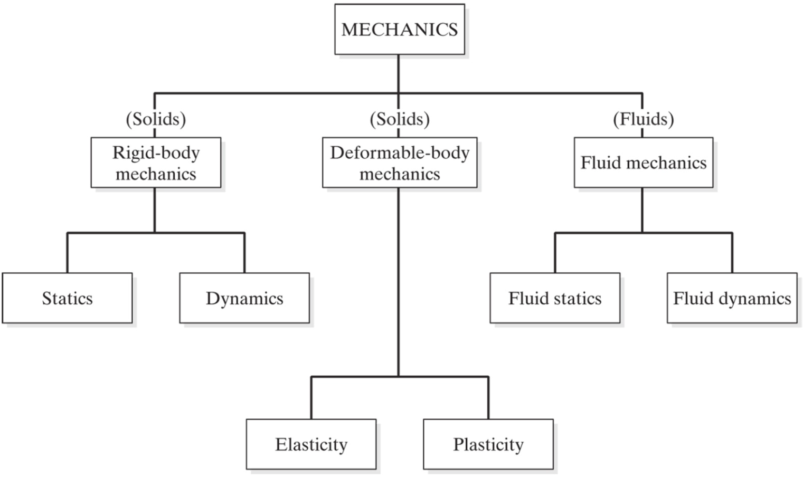

## What is Statics?

Mechanics is the study of the state of rest or motion of bodies that are subjected to forces.

_Statics_ is the study of rigid bodies (object that don't change shape) that are in static equalibrium, which means the rigid bodies aren't accelerating.

Engineering Statics is the gateway into engineering mechanics, which is the application of Newtonian physics to design and analyze objects, systems, and structures with respect to motion, deformation, and failure.

The subject is called “statics” because it is concerned with particles and rigid bodies that are in equilibrium, and these will usually be stationary, i.e. static. {cite}`engineering_statics_open_and_interactive`

The study of rigid bodies that accelerate and move is called _dynamics_.
