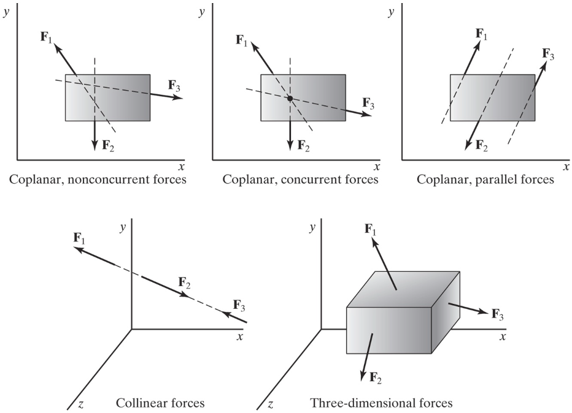

## Forces

A force is an influence that causes a body to deform or accelerate.  

Common forces include: contact, gravitational, tension, pressure, and fluid forces.

### Point of Application

The point, or points, at which a force is applied to a body is important for understanding how the body will react. For particles, there is only a single point for the forces to act on, but for rigid bodies there are an infinite number of possible points of application. Some points of application will lead to the body undergoing simple linear acceleration; some will exert a moment on the body which will cause the body to undergo rotational acceleration as well as linear acceleration.

Depending on the nature of the point of application of a force, there are three general types of forces. These are point forces, surface forces, and body forces. Below is a diagram of a box being pulled by a rope across a frictionless surface. The box has three forces acting on it. The first is the force from the rope. This is a force applied to a single point on the box, and is therefore modeled as point force. Point forces are represented by a single vector. Second is the normal force from the ground that is supporting the box. Because this force is applied evenly to the bottom surface of the box, it is best modeled as a surface force. Surface forces are indicated by a number of vectors side by side with a profile line to indicate the magnitude of the force at any point. The last force is the gravitational force pulling the box downward. Because this force is applied evenly to the entire volume of the box, it is best modeled as a body force. Body forces are sometimes shown as a field of vectors as shown, though they are often not drawn out at all because they end up cluttering the free body diagram.

Image Credit: Mechanics Map Textbook http://mechanicsmap.psu.edu/websites/1_mechanics_basics/1-3_forces/forces.html

We will also sometimes talk about distributed forces. A distributed force is simply another name for either a surface or a body force.

The exact point or surface that the force is acting on can be drawn as either the head or the tail of the force vector in the free body diagram. Because of the principle of transmissibility, both options are known to represent the same physical system.

### Forces as Vectors

Forces are vectors.

Multiple forces acting on a body create a force system.

The sum of all forces acting on a body is the net force (also called the resultant force).

### Combining Forces

All of the forces acting on an object combine or sum to create a resulting force acting on the object.

Example: Two forces $\vec{A}$ and $\vec{B}$ are applied to a point mass, what is the resultant force, $R$? 

$ \vec{A} = (5kN)\hat{i} +(9kN)\hat{j} \ $ and $ \ \vec{B} = (-4kN)\hat{i} +(2kN)\hat{j}$ 

$$ \vec{R} = \vec{A} + \vec{B} $$
        
$$ \vec{R} = (5kN)\hat{i} +(9kN)\hat{j} + (-4kN)\hat{i} +(2kN)\hat{j} $$
       
$$ \vec{R} = (1kN)\hat{i} +(11kN)\hat{j} $$

Or report as a magnitude and direction

$ \vec{R} = 11.05 \ kN \  \text{at} \ 84.8^{\circ} $ above the positive x-axis.
