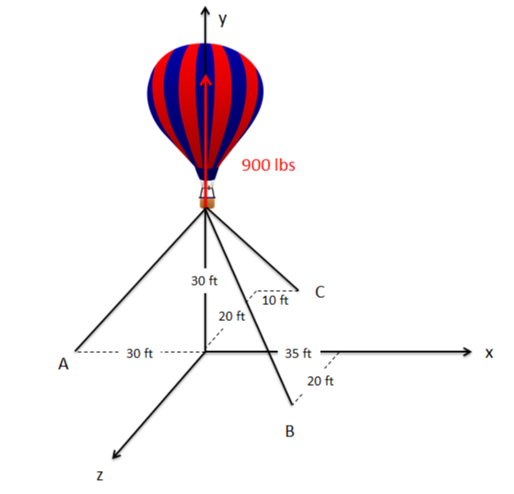

## Exersizes

1. A 250 $lb_m$ box is held in place by a cord with a spring scale on an inclined plane as shown. Assume the surface between the ramp and the box is frictionless.

Determine:

a. The free body diagram for the box

b. The weight of the box in pound-force given that it is on the moon with acceleration due to gravity of
approximately 5.37 $ft/s^2$

c. The force reading on the scale when the ramp is inclined $20^{\circ}$ as shown.

2. A construction worker holds a 200 $kg$ crate in the position shown. The crane is on Earth where the acceleration due to gravity is 9.81 $m/s^2$.

Determine:

a. The free body diagram for point A

b. What force must the worker exert on the cable to keep the crate in equilibrium?

3. An object is suspended from cables as shown below. Assume the acceleration due to gravity is 9.81 $m/s^2$.

a. Draw the free body diagram for the system; label all forces and angles.

b. What is the tension in AB?

c. What is the tension in AC?

4. Forces A and B act on a point at the origin as shown. It is known that:

$$ A = 45 \ lb_f $$

$$ B = 90 \ lb_f $$

$$ \alpha = 20^{\circ}$$

$$ \beta = 50^{\circ} $$

A third applied Force, C, puts the system in equilibrium.

Determine:

a. The magnitude of C

b. The direction of C as an angle positive counter clockwise from the +x-axis. (To the nearest $0.1^{\circ}$)

5. On Earth, a 150 $kg$ block rests on an inclined plane at an angle $\alpha$. If the coefficient of static friction between the block and the ramp is 0.54.

Determine the following:

a. Draw a free body diagram for the block.

b. What is the weight of the block?

c. In terms of $\alpha$, what is the magnitude of the normal force on the block?

6. A traffic light is supported by two cables as shown below. The tension in cable one ($T_1$) is measured to be 294.8 N. What is the tension in cable two? What is the mass of the traffic light? {cite}`mechanics_map`

Image Credit: Mechanics Map CC BY-SA 4.0 {cite}`mechanics_map`

7. A pulley system is being used to hoist a 50 $kg$ engine block as shown below. Distance $d$ is 1 meter and assume the pulleys are all frictionless. Draw a free body diagram of the engine block with the attached pulley. Include all forces and important angles. {cite}`mechanics_map`

Image Credit: Mechanics Map CC BY-SA 4.0 {cite}`mechanics_map`

8. The car shown below has a weight of 4500 $lbs$ and a center of mass at point $G$. Assuming the car is not moving and is sitting on a level surface, draw a free body diagram of the car. Include all forces. {cite}`mechanics_map`

Image Credit: Mechanics Map CC BY-SA 4.0 {cite}`mechanics_map`

9. A telephone pole sits on a rough surface. A cable attached to an excavator is then used to pull the pole along the surface as shown below. Assume the telephone pole has a mass of 350 $kg$ and a length of 12 meters. Draw a free body diagram of the telephone pole. Include all forces, important distances, and important angles. {cite}`mechanics_map`

Image Credit: Mechanics Map CC BY-SA 4.0 {cite}`mechanics_map`

10. Two weights are supported via cables as shown below. If body B has a weight of 60 pounds, what is the expected weight of body A based on the angles of the cables? {cite}`mechanics_map`

Image Credit: Mechanics Map CC BY-SA 4.0 {cite}`mechanics_map`

11. A hot air balloon is tethered as shown below. Assuming that the balloon is pulling upward with a force of 900 $lbs$, determine the tension in each of the cables. {cite}`mechanics_map`

Image Credit: Mechanics Map CC BY-SA 4.0 {cite}`mechanics_map`

12. A 24 $kN$ crate is being lowered into the cargo hold of a ship. Boom $AB$ is 20 $m$ long and acts at a $40^{\circ}$ angle from kingpost $AC$. The boom is held in this position by topping lift $BC$ which has a 1:4 slope. Determine the forces in the boom $AB$ and in the topping lift cable $BC$. {cite}`engineering_statics_open_and_interactive`

Image Credit: Engineering Statics: Open and Interactive CC BY-NC-SA 4.0 {cite}`engineering_statics_open_and_interactive`
