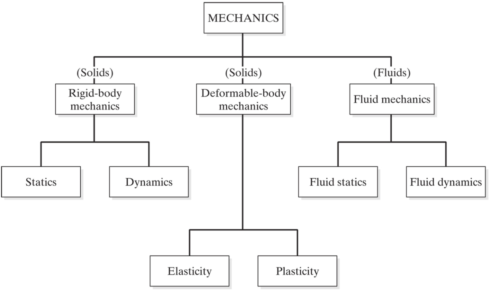
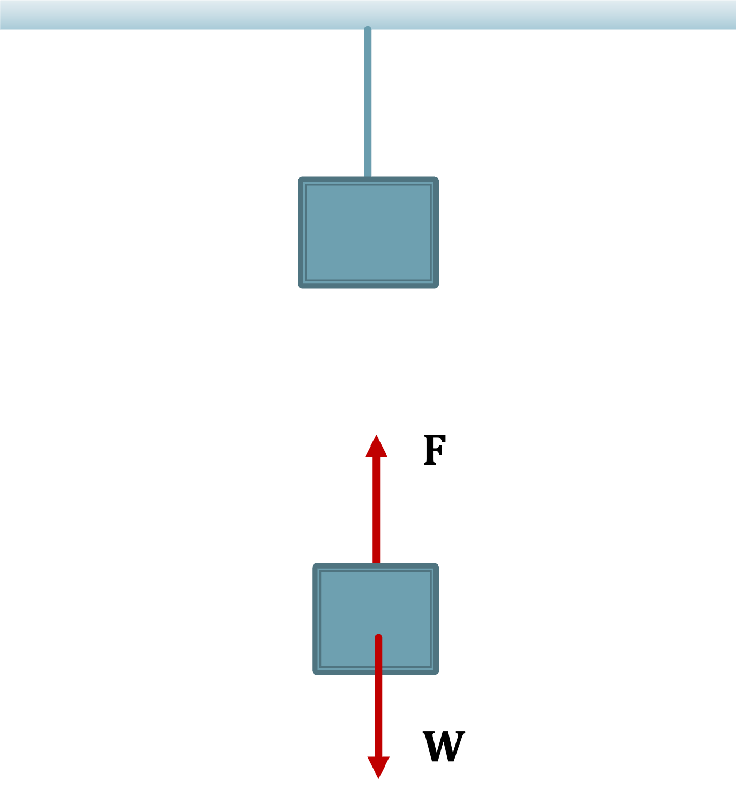

## What is Strengths?

In the previous chapter, we discussed the subject of statics. In statics two assumptions are typically made:

 * The free body is in static equalibrium
 * The free body does not deform

However, given a load or force applied to a component, if the component is fixed in place, the load or force could cause the component to bend and even break. One of the fundamental assumptions we make in statics is that bodies are rigid, that is, they do not deform, bend, or change shape. We know this assumption is not true for real materials, therefore we need to build analytical models and tools to analyze deformation.

Mechanics is the study of the state of rest or motion of bodies that are subjected to forces. This chapter focuses on the mechanics of deformable bodies.

External forces act on a body. For example, the weight of the crate acts on the supporting cable.

If the system is in equilibrium we know that the tension (tensile force) in the cable is equal to the weight of the crate.

But what does this do to the cable? The weight of the box will cause the cable to stretch.
