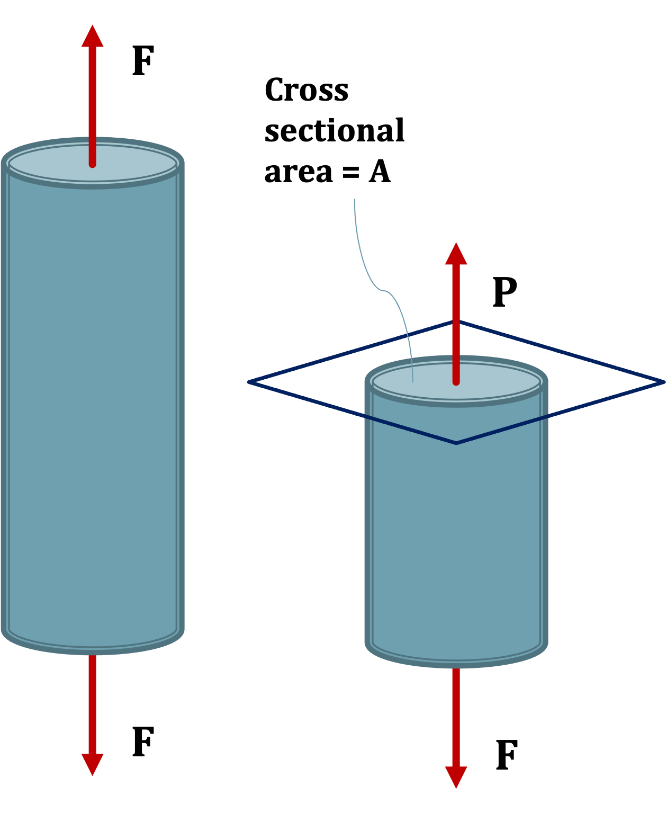

## Internal Forces

External forces create internal forces.

Internal forces do not effect equilibrium.

Internal forces are related to stress and strain.

Looking at a section of the cable, where F is the tensile force on the cable we note that the cable is in equilibrium.  

If we look at a plane perpendicular (normal) to the axis of the cable we see the cross-sectional area and the internal force P.

The normal stress in the cable is

$$ \sigma = \frac{P}{A} $$

Where $\sigma$ denotes stress, $P$ is the internal force, and $A$ is the cross-sectional area $P$ is applied over.
