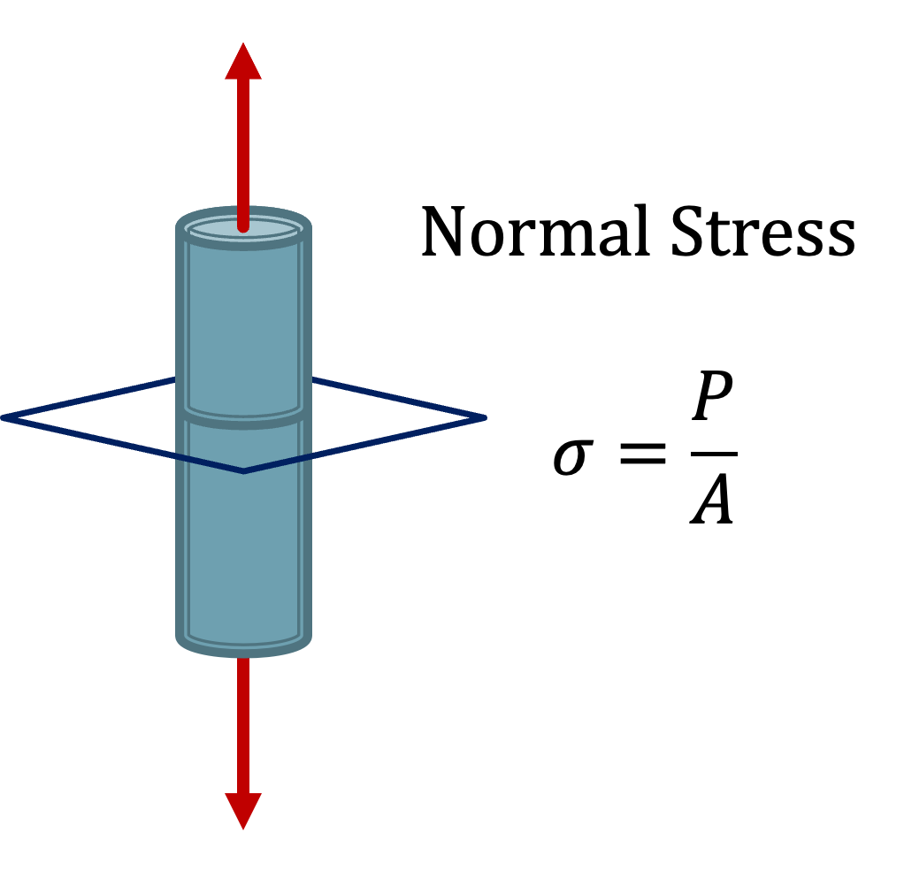
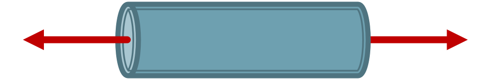
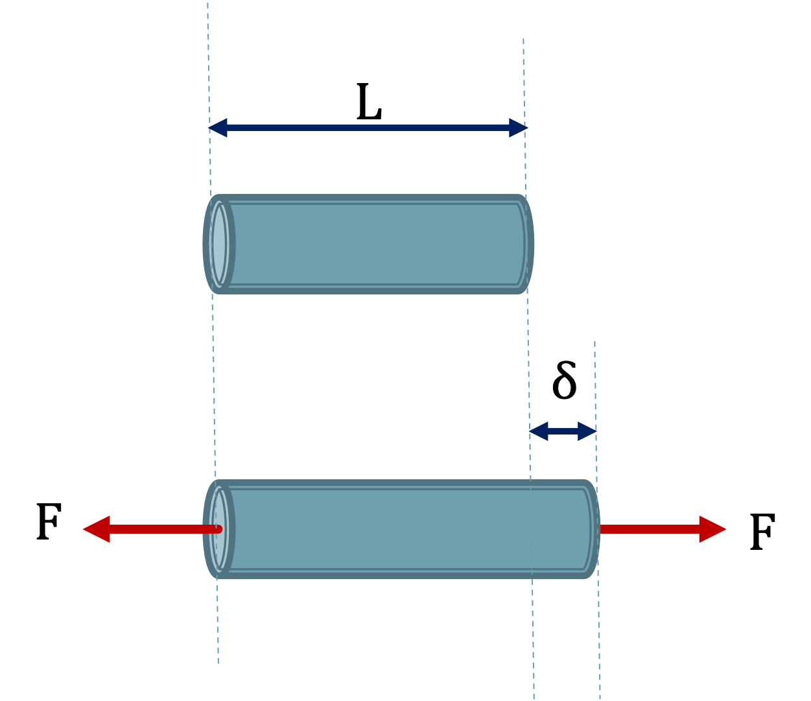

## Stress and Strain

The concepts of _stress_ and _strain_ are foundational to modeling how materials deform under an applied load.

### Stress

Stress is the ratio of force to area (force divided by cross-sectional area).  There is both normal stress (also called axial stress) and shear stress.  For this introductory text we will primarily deal with normal stress.

#### Units of Stress

USCS: $psi$ (pounds per square inch) or $ksi$ ($kip$ per square inch, where 1 $kip$ is 1000 $lb_f$)

$$ psi = \frac{lb_f}{in^2} $$

$$ ksi = \frac{1000 lb_f}{in^2} $$

SI: Pa (pascals), or when appropriate kPa (kilo pascals) or MPa (mega pascals)

$$ Pa = \frac{N}{m^2} $$

$$ MPa = \frac{N}{mm^2} $$

#### Compression and Tension

For normal stress, we can look at members in either tension or compression.

The external forces that are responsible for creating stress, also create deformation (change in size or shape).

Members in tension will tend to lengthen.

Members in compression will tend to shorten.

### Strain

Looking at an axially loaded member in tension.

Unloaded the member has an initial length, $L$.

When loaded the member axially deforms by length $\delta$.

The normal strain in the member $\epsilon$ is:

$$ \epsilon = \frac{\delta}{L} $$

#### Units of Strain

Strain has dimensions of length/length.

USCS: in/in

SI: m/m, or mm/mm
