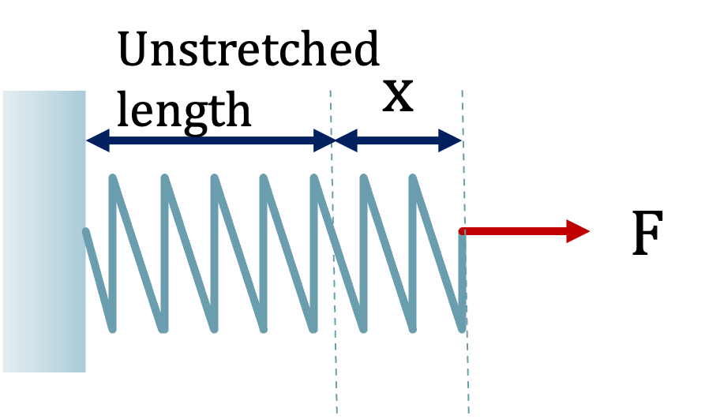
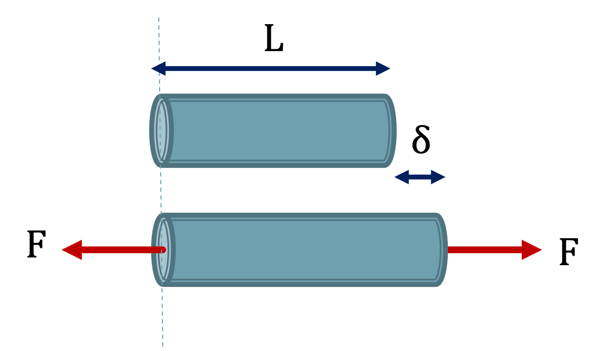

## Elastic Deformation

Hooke’s Law states

$$ F = kx $$



Within the linear-elastic region we can use a similar mathematical form relating stress and strain

$$ \sigma = E\epsilon $$

Where $E$ is the proportionality constant called the Modulus of Elasticity or Young’s Modulus, which is material dependent.



Using this relation we can substitute in the previous definitions for stress and strain

$$ \sigma = E\epsilon $$

$$ \frac{P}{A} = E \frac{\delta}{L} $$

And solve directly for deformation $\delta$.

$$ \delta = \frac{PL}{AE} $$

```{note}
Remember, solving for $\delta$ using the equation above is **only valid within the linear elastic region**
```
