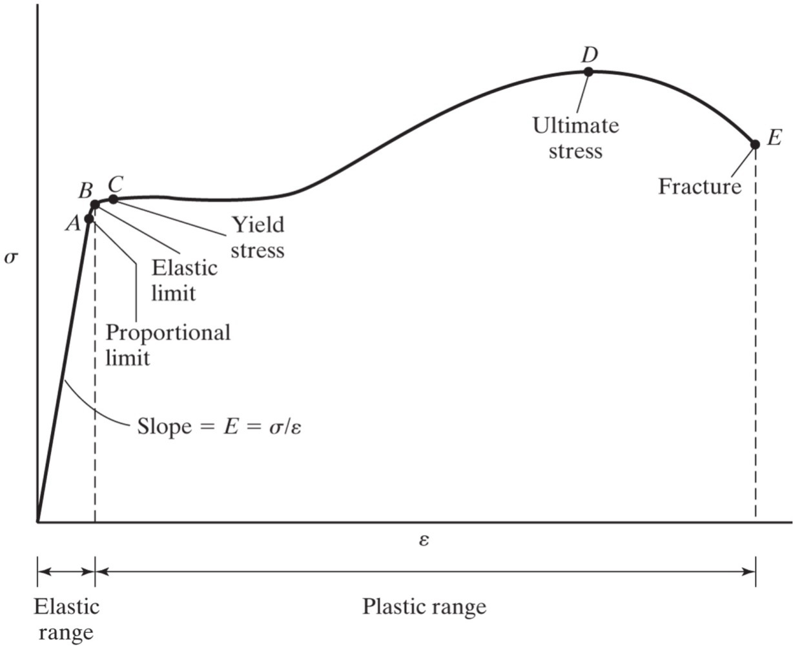

## Stress Strain Curves

Stress is the primary physical quantity that is used to determine whether a structure can withstand the external forces applied to it.

It is not the force that is the limiting factor – it is the amount of stress the material can withstand.

### Material Properties

The following material properties can be derived from a stress-strain curve.

Stiffness:  slope in elastic range

Ductility:  total amount of plastic deformation

Yield stress = $\sigma_y$ = yield strength: transition out of elastic range

Ultimate stress = $\sigma_{UTS}$ = ultimate strength: highest stress
