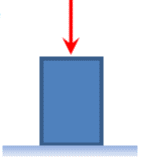

## Exersizes

1. Given the stress strain surve shown below, determine the following:

a. Rank the materials by stiffness. List most stiff first and least stiff last.

b. Rank the materials by ductility. List most ductile first and least ductile last.

c. Rank the materials by yield strength. List the highest yield strength first and the lowest yield strength last.

d. Rank the materials by ultimate strength. List the highest ultimate strength first and the lowest ultimate strength last.

2. A steel bar with a diameter of $0.875 \ in.$ and a length of $15.0 \ ft$ is axially loaded with a force of $21.6 \ kip$. The modulus of elasticity of the steel is $29 \times 10^6$ $psi$. Determine:

a. What is the axial stress in the bar?

b. What is the axial strain in the bar?

c. What is the change in the length of the bar?

3. A cylinder of high strength concrete will be compressed until failure. If the compression strength of the concrete is $42 \ MPa$, how much force will need to be applied if the cylinder has a diameter of $120 \ mm$?

4. A block of $43.7 \ slugs$ is supported on a frictionless inclined plane by a steel rod ($σ_y = 36.0 \ ksi$) that is parallel to the incline of the plane. The plane is inclined at an angle of $30^{\circ}$. The acceleration due to gravity is $32.2 \ ft/s^2$. Determine the following:

a. Draw a free body diagram for the block.

b. What is the tension in the steel rod?

c. For a factor of safety against yield of $2.15$, what is the minimum required diameter for the rod? Report your answer to the nearest $0.001 \ inch$.
