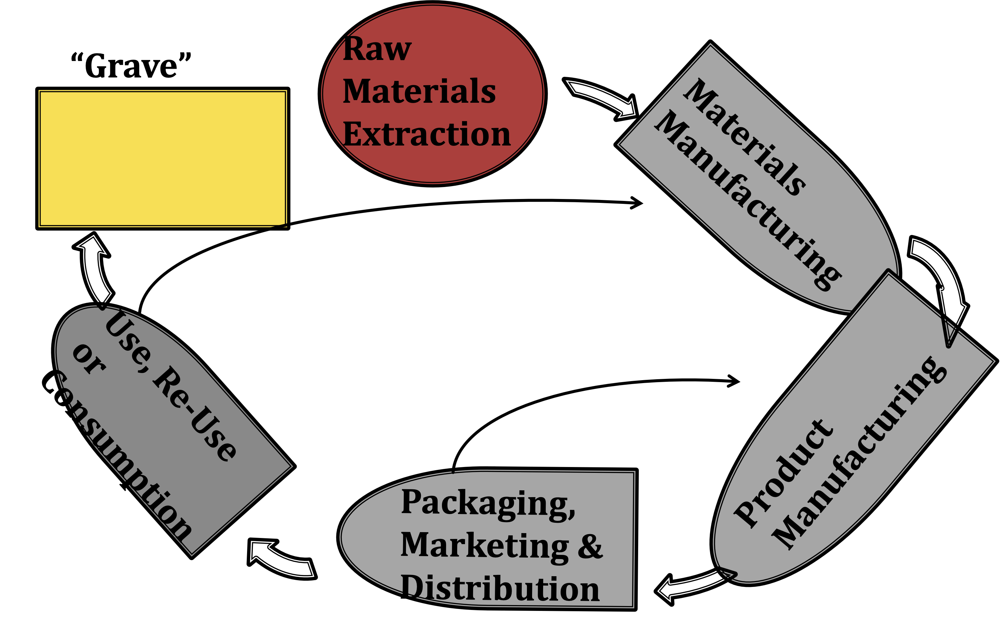

## Analyzing Sustainability

The earth is a complex non-linear system.

Linear system with independent variables

Non-linear system with interdependent variables

### Scientific Concepts

**First law of Thermodynamics** – conservation of energy - energy can neither be created nor destroyed it can only change form.

 > Matter and energy cannot disappear

**Second law of Thermodynamics** – entropy of a closed system cannot decrease
 
 > Matter and energy tend to disperse
 
All real systems have losses – thermal or mechanical

#### Additional Scientific Concepts

 * With regard to many processes, Earth is a closed system
 * Value of matter is in its concentration and structure – energy density varies
 * All species of plants and animals are adapted to their environment – adaptation to change takes time
 * Limited resources/ non-renewable resources
 * Time scale matters
 
### Assessment Methodologies

#### Economic

 * Cost / Benefit analysis
 * Modeling / regressions
 * Probability scenarios

#### Environmental

 * Life-cycle analysis
 * Material flows
 * Resource accounting
 * Ecological foot print
 * NAMEA (National Accounting Matrix with Environmental Accounts) - a tool developed by EUROSTAT (the European Commission's statistics service) to analyze relationships between the economy and the environment.

#### Social

 * Sustainable livelihoods
 * Human and social capital evaluation
 * Participatory processes

### Life Cycle Analysis

Design Life

 * Where did it come from?
 * How is it used?
 * Where will it go?

10 different ISO standards for Life-cycle assessment

### "Zero Waste" and Cradle to Cradle Design

Cradle to cradle design

 * A strategy for sustainability that aims to use all of the resources involved in  production process and use them completely. 
 * Works by taking what could be considered waste from one process and using it as inputs to other process.
 * Requires that all products be reusable or biologically de-gradable in a finite time frame

### Carbon and Water Accounting

The concept of a _carbon footprint_ is to obtain a quantifiable impact of a business or persons activities on the environment by converting activities to an equivalent amount of carbon dioxide used. The units of measurement are tonnes or kilograms.

The total amount of water a person or business uses is defined as their water footprint.

A surprisingly large amount of water is need to produce the energy, food and products that we all use.

#### Carbon and Water Footprint Calculators

US Government, Environmental Protection Agency Personal Emissions Calculator

[EPA Carbon Footprint Calculator](https://www3.epa.gov/carbon-footprint-calculator/)

Household Water Calculator
    
[Home Water Works Household Water Caclulator](https://www.home-water-works.org/calculator/)
